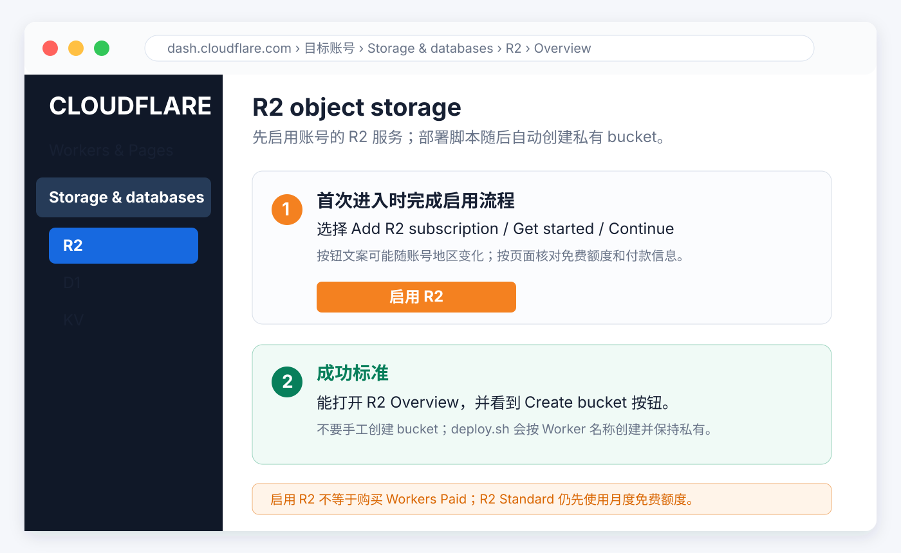
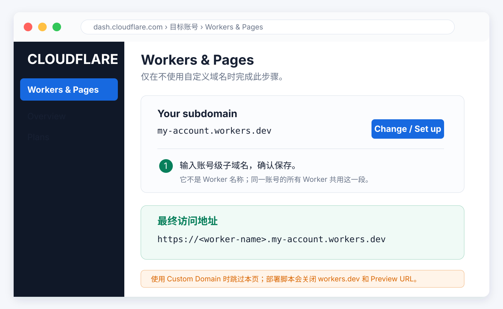
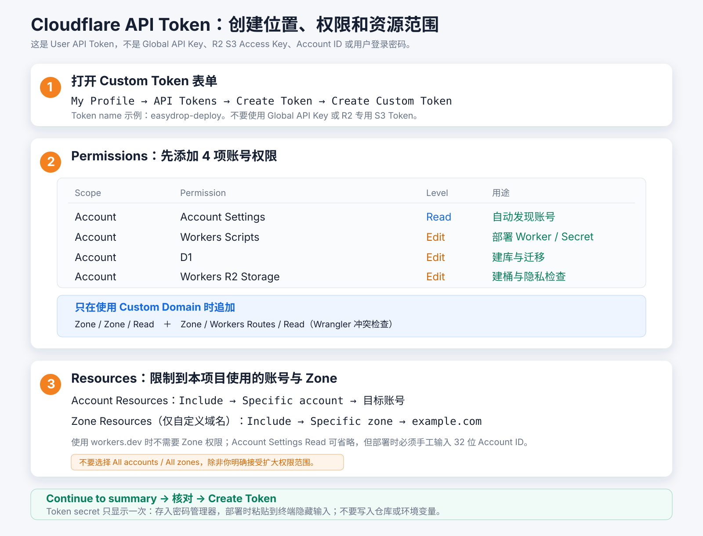

# EasyDrop

EasyDrop 是一个基于 Cloudflare Workers 的文本与文件分享工具，使用用户名和密码登录、D1 数据库和私有 R2 对象存储。部署后，电脑、手机和平板可以访问同一个 HTTPS 地址交换内容，不需要在个人电脑上持续运行服务，也不要求设备处于同一局域网。

适合个人跨设备传递文本和文件，或让多个用户在同一站点使用相互隔离的个人空间。管理员可以控制注册并管理用户账号，但不能查看其他用户的内容。

## 目录

- [已实现功能](#已实现功能)
- [架构与数据存储](#架构与数据存储)
- [费用与用量估算](#费用与用量估算)
- [本地运行](#本地运行)
- [部署](#部署)
- [配置](#配置)
- [鉴权与安全](#鉴权与安全)
- [接口说明](#接口说明)
- [项目结构与命令](#项目结构与命令)
- [常见问题](#常见问题)
- [使用边界](#使用边界)
- [验证](#验证)

## 已实现功能

### 用户登录与管理

- 未登录打开主页会跳转登录页，输入正确的用户名和密码后进入分享页面。
- 自助注册默认关闭；管理员可在“用户管理”中临时开放。自助注册的账号固定为普通用户且处于待启用状态，管理员启用后才能登录。
- 首次部署交互创建一个管理员；管理员仍可新增用户、修改资料或密码、启用、禁用和删除用户，并可设置管理员或普通用户角色。
- 每个登录用户拥有独立的文本、文件、上传状态、历史版本和幂等操作空间。管理员只管理账号，不自动获得其他用户内容的访问权限。
- 用户名统一转为小写，长度为 3～32 位，只允许字母、数字、点、下划线和连字符。
- 密码长度必须为 12～32 位，并同时包含数字、大写字母和小写字母。
- 登录用户可在“账户设置”中验证当前密码后修改密码、生成恢复码或注销账号。修改密码会撤销全部会话并使已有恢复码失效。
- 恢复码使用 256-bit 随机值，只在注册或生成时展示一次，D1 仅保存 SHA-256 摘要。恢复成功后该恢复码立即失效；丢失时仍可由管理员重置密码。
- 注销账号会立即禁用账户并撤销会话，随后后台分批删除该用户的 D1 内容和 R2 文件。最后一个已启用管理员不能注销。
- 每个浏览器登录后建立独立的服务端会话，默认空闲有效期为 30 天；持续访问时默认每隔至少 15 分钟才将服务端会话和 Cookie 延长 30 天，避免高频轮询产生同频 D1 写入。
- 修改用户资料或密码、禁用用户、删除用户时，会立即撤销该用户的全部会话，不等待轮询或定时清理。
- 登录状态通过 HttpOnly Cookie 保存，不将密码或会话令牌写入 `localStorage`。
- 点击退出登录会撤销当前会话，不影响其他已登录设备。前端同时停止轮询、取消在途请求并返回登录页。
- 会话过期或密码变更后，后续受保护请求被拒绝，需要重新登录。
- 历史记录、文本提交、上传、常规下载、删除和清空都要求登录。只有登录用户主动为文件创建的限时链接可以免登录下载。

### 文本分享与复制

在文本区域输入内容后点击“分享文本”，保存成功的记录会出现在当前用户的分享历史中，同一账号的其他登录设备可读取并复制。

- 支持中文、多行文本和代码片段，保留原始换行及前后空白。
- 空内容或只有空白的内容不能提交；默认单条上限为 128 KiB（131072 字节），按 UTF-8 字节数计算，而不是字符数。
- 输入区域显示当前大小和允许上限，超过上限时不能提交，后端也会独立校验。
- 历史记录显示创建时间和完整文本。内容仍作为纯文本展示，不执行其中的 HTML 或脚本，也不渲染 Markdown；其中有效的 `http://` 和 `https://` 地址会显示为可点击的新窗口链接。
- 每条文本可以一键复制或删除。复制依赖浏览器剪贴板权限，线上需要通过 HTTPS 使用。
- 一次提交未结束时不能重复提交，但可以继续编辑下一条草稿；上一条成功返回时不会清掉已经改变的输入。

### 多文件上传

点击“选择文件”可一次选择多个文件。文件之间按队列逐个处理，每个非空文件使用 R2 Multipart Upload 分片并发上传。

- 默认单文件上限为 200 MiB，前端与后端都会检查；页面大小标签使用 KB/MB，换算基数为 1024。
- 默认按 5 MiB 分片、3 路并发上传；最后一片可以小于 5 MiB。每个 Worker 请求只处理一个分片，不在服务端缓冲完整文件。
- 浏览器先逐片计算 SHA-256，并基于全部分片摘要生成整文件指纹；Worker 再校验每个分片正文。整文件指纹与操作键绑定，分片摘要与 R2 ETag 一起持久化，防止网络错误或同名同大小文件混用错误分片。
- 支持中文文件名、空文件和多个同名文件。同名文件使用不同内部 ID 保存，不覆盖已有文件，下载时恢复原文件名。
- 文件名最多 255 个 UTF-8 字节，不允许路径分隔符或控制字符。
- 上传按钮在传输期间切换为“暂停上传”；暂停会中止在途分片，已经由服务端确认的分片不会丢失。再次点击“继续上传”会读取服务端状态，只补传缺失或校验不一致的分片。
- 每个文件显示总进度、当前校验/上传分片及“已上传”或“失败”状态；只有多分片文件在提交对象时显示“正在合并”，单分片文件保持“上传分片 1/1”直至发布完成。传输达到 100% 不等于发布完成，只有 R2 完成提交和 D1 发布都确认成功才显示“已上传”。
- 部分失败时保留已成功文件，显示失败数量及错误详情；再次点击上传只处理尚未成功的文件。
- 页面按用户 ID 把文件名、大小、最后修改时间、整文件指纹、操作键和上传 ID 保存在浏览器 `localStorage`，不保存文件内容。刷新或重新打开页面后，需要重新选择原文件；匹配后可以继续使用服务端已保存的分片。
- 上传会话每次确认分片或恢复时续期，默认空闲 24 小时后由定时任务终止。R2 默认也会在 7 天后自动终止未完成 Multipart；不要把 R2 的该生命周期改得短于应用恢复窗口。
- 上传期间禁用文件重新选择和当前页面的“清空历史”。离开页面时浏览器可能提示尚有进行中的操作。
- 单个分片的浏览器上传超时为 30 分钟，失败时最多重试 3 次，并在文件状态中显示重试次数；这不是对 Cloudflare 平台请求时长、网络或套餐限制的保证。

### 重试与重复提交保护

文本提交和文件上传使用操作键 `Idempotency-Key`。前端为一次操作生成 UUID v4，重试时复用，后端通过 D1 保存该操作的状态和结果。

| 操作状态 | 再次请求的行为 |
| --- | --- |
| 已保存成功，但客户端没有收到响应 | 返回原记录，不重复写入 |
| 同一个操作仍在处理中 | 返回 `409`，稍后可使用同一个键重试 |
| 操作已明确失败 | 允许重新认领并执行，同一时间只有一个重试能认领 |
| 操作已成功，但对应记录已被删除 | 返回 `410`，不自动重建记录 |
| 操作键被用于不同的请求参数 | 返回 `409`，拒绝复用 |

完成或失败的操作记录通常保留约 24 小时，由定时任务清理。进行中的分片上传会刷新操作时间；同一浏览器重新选择匹配文件时复用原操作键。操作记录过期后会创建新的上传。

文件操作键绑定文件名、大小、分片大小和整文件指纹；这用于恢复校验，不做跨操作的内容去重。自行调用 API 时，不得将同一个键同时用于不同文件。

### 文件下载

- 点击文件记录的下载按钮，由 Worker 验证会话和记录状态，再从私有 R2 读取内容。
- JPEG、PNG、GIF、WebP、AVIF 和 BMP 文件在历史记录中显示懒加载缩略图；点击缩略图仍按附件下载原文件。SVG 不内联展示。
- 缩略图接口直接读取原始 R2 对象并由浏览器按固定尺寸显示，不生成或保存第二份缩略图，因此图片进入视口时会产生一次完整原图读取。
- 每条文件记录提供可打开的文件链接和复制按钮；鼠标悬停或键盘聚焦链接图标时显示该文件地址的二维码。
- 文件链接和二维码只包含站点内的受保护下载地址及 URL 编码的原文件名，不包含用户名、密码或会话凭据；新设备打开后会先进入登录页，登录成功自动开始下载并返回主页。
- 每个文件可以另行创建 1～168 小时有效的临时链接和二维码。临时链接无需登录，创建新链接会立即替换同一文件的旧链接，也可以在到期前主动撤销。
- 临时链接使用 256-bit 随机令牌，D1 只保存 SHA-256 摘要。持有链接的任何人都能在有效期内下载，应按公开凭据管理，避免发到不可信渠道。
- 文件以附件方式返回，不在本站域名下直接执行或预览用户上传的 HTML。
- 支持 `GET` 下载、`HEAD` 查看元数据，以及单段 HTTP `Range` 请求；返回 `Accept-Ranges`、`ETag` 和 `Last-Modified`，非法范围返回 `416`。
- 下载协议支持从指定字节位置续传。浏览器或下载器需要自行保存已下载位置并重新发送 `Range` 请求，页面本身没有暂停、恢复或断点任务管理界面。
- 服务端允许多个独立的单段 Range 请求并发读取同一文件，因此支持 Range 的第三方下载器可以尝试分段并行下载；本站点击下载只发起普通浏览器下载，不主动启用多线程。
- 下载地址以内部文件 ID 定位对象，并携带 URL 编码的原文件名和后缀；服务端要求文件名与记录严格匹配，不暴露 R2 公开链接，也不在 URL 中携带用户名或密码。
- 未登录返回 `401`，已经删除或不存在的文件返回 `404`。

### 分享历史与跨设备同步

- 文本和文件展示在同一个列表中，按记录序号从新到旧排列。
- 时间在服务端保存为 Unix 时间戳，浏览器按本机时区和区域格式展示。
- 使用游标加载更早记录，不一次拉取全部历史。记录数量显示的是当前已加载条数，有下一页时带 `+`，不是全库总数。
- 默认每 5 秒检查一次历史版本；页面不可见时停止计时，正在上传或加载历史时跳过当次检查。
- 页面重新可见、窗口重新获得焦点或网络恢复时会立即检查，不等待下一轮计时。
- 发现版本改变后自动刷新；已经展开更多历史时会重新加载相同范围，并用当前可见记录恢复滚动位置。
- 网络错误会显示完整错误信息，并按 5、10、20、40、60 秒逐步退避重试；成功后恢复 5 秒间隔。

单页条数同时受 `HISTORY_PAGE_SIZE` 和文本大小上限约束：

```text
实际页大小 = min(HISTORY_PAGE_SIZE, max(1, floor(1048576 / MAX_TEXT_BYTES)))
```

默认 `HISTORY_PAGE_SIZE=50`、`MAX_TEXT_BYTES=131072`，因此实际每页最多返回 8 条。该约束对文本和文件混合列表统一生效。

### 删除与清空

单条记录提供删除按钮，历史区域提供清空按钮，两者都需要二次确认。

- 删除文本会移除分享记录；删除文件会移除记录并安排删除对应 R2 对象。
- 清空会将当时已有的分享记录和待完成上传标记为删除，不仅清空页面显示。
- 服务端先撤销记录的可见性与新下载权限，再异步清理实体文件，因此接口返回 `202` 表示删除已受理，不保证 R2 对象已经全部移除。
- 每次删除请求会触发一批后台清理，定时任务继续处理剩余记录或失败重试。
- 同一账号的其他设备在清空之后发起的新分享仍可写入；清空不影响其他用户。
- 没有回收站或撤销功能。已复制到剪贴板、已下载或已经开始传输的内容不能追回。

### 访问二维码与移动端

鼠标悬停或键盘聚焦页面顶部的二维码按钮时，会直接显示当前站点二维码和完整地址；点击后打开大图弹窗并可复制地址。二维码只包含站点 Origin（协议、域名及必要的端口），不包含用户名、密码、Cookie 或其他登录凭据。

手机扫码后仍需要正常登录。页面适配桌面和手机宽度，支持长文件名换行。使用本机预览地址时，二维码中的 `127.0.0.1` 只代表打开地址的设备自身，不能用于手机访问电脑；跨设备使用应部署到可访问的 HTTPS 域名。

## 架构与数据存储

| 组件 | 职责 |
| --- | --- |
| Cloudflare Worker | 路由、登录鉴权、参数检查、分享接口、下载和后台清理 |
| Workers Static Assets | 提供构建后的 HTML、JavaScript 和 CSS |
| D1 数据库 | 保存用户、密码验证器、文本正文、文件元数据、会话、登录计数、操作状态和历史版本 |
| 私有 R2 存储桶 | 保存文件二进制内容，对象路径为 `files/<内部ID>` |
| Cron Trigger | 定期清理过期状态、待删除文件和遗留对象 |

静态资源配置为 `run_worker_first: true`，请求先经过 Worker 路由。登录页面以及 JS/CSS 可以在未登录时访问，实际分享主页和数据仍受会话保护。

D1 表的用途：

| 表 | 保存内容 |
| --- | --- |
| `users` | 用户名、密码验证器、恢复码摘要、角色、审核/启用/注销状态、鉴权版本和用户级内容版本 |
| `items` | 所属用户、文本或文件记录、受支持的图片媒体类型，以及 `pending`、`ready`、`deleting` 状态 |
| `sessions` | 用户 ID、会话令牌摘要、CSRF Token、鉴权版本和滑动过期时间 |
| `login_attempts` | 来源 IP 与全站登录尝试计数 |
| `account_attempts` | 自助注册与密码恢复的独立来源 IP/全站计数 |
| `operations` | 所属用户、幂等操作键、请求指纹、结果记录 ID 和执行状态 |
| `multipart_uploads` | R2 Multipart Upload ID、分片大小、分片总数、状态和最后活动时间 |
| `multipart_parts` | 已确认分片的序号、大小、SHA-256 和 R2 ETag |
| `file_shares` | 每个文件当前临时链接的令牌摘要和到期时间 |
| `app_state` | 自助注册开关和 R2 遗留对象检查游标 |

文件先登记为 `pending`，R2 写入成功后再发布为 `ready`。只有 `ready` 记录能进入历史列表并提供下载，删除后转为 `deleting`。D1 与 R2 不是跨服务事务，后台任务负责补偿清理。

当前 Cron 表达式为 `*/15 * * * *`，每 15 分钟执行一次，处理以下内容：

- 删除已过期的会话和超过一天的登录计数。
- 删除已到期的临时文件链接记录；即使定时清理尚未运行，到期链接也会在请求时被拒绝。
- 将空闲超过 `UPLOAD_SESSION_TTL_SECONDS`（默认 24 小时）的分片上传标记为待删除并终止 Multipart；初始化阶段中断且尚未建立 Multipart 的记录按一小时回收。
- 清理超过一天的幂等操作记录。
- 默认最多处理 4 批待删除记录，每批 50 条；纯文本清理不请求 R2。
- 注销用户的内容清理完成后，彻底删除对应用户记录。
- 每次分页检查最多 50 个 R2 对象，删除不存在对应 D1 记录且已存放超过一小时的遗留对象，保存游标供下一次继续。

上述时间是进入清理条件的阈值，不是严格的实际删除时刻。大批量积压或服务错误可能让清理延后。正常分享的文本和文件不会自动过期，会保留到主动删除。

## 费用与用量估算

价格核对日期：**2026-09-13**。本项目默认可以直接使用 Workers Free、D1 Free 和 R2 Standard 免费额度，**没有固定月费**。三项服务都未超出免费额度时，云端费用为 **$0/月**。

`$5/月` 仅是主动升级到 **Workers Paid** 后的账户最低月费，不是部署 Worker、创建 D1 或启用 R2 的前置费用。Workers Free 或 D1 Free 超过硬限制时会拒绝请求，不会自动升级或扣取 `$5`。R2 Standard 有独立的月度免费额度，超出后只按 R2 超额用量计费，不要求同时购买 Workers Paid。

### 免费额度

| 项目 | 免费额度 |
| --- | --- |
| Worker 调用 | 每天 100,000 次 |
| Worker CPU | 每次调用最多 10 ms |
| D1 读取 | 每天 5,000,000 行 |
| D1 写入 | 每天 100,000 行 |
| D1 存储 | 账户合计 5 GB；Free 单个数据库最多 500 MB |
| R2 Standard 存储 | 每月 10 GB-month |
| R2 A 类操作 | 每月 1,000,000 次，主要是上传和列举 |
| R2 B 类操作 | 每月 10,000,000 次，主要是下载和读取元数据 |
| R2 删除与出站流量 | 免费 |

这些额度由同一 Cloudflare 账户下的项目共享，不是每个 Worker、D1 数据库或 R2 桶各有一份。R2 免费额度只适用于 Standard 存储，不适用于 Infrequent Access。

### 这套实现如何产生用量

| 行为 | 主要计量 |
| --- | --- |
| 打开页面、请求 JS/CSS | 当前 `run_worker_first: true` 会执行 Worker，计调用及 CPU；静态资源存储本身免费 |
| 每次历史版本轮询 | 1 次 Worker 调用、1 次 D1 会话和版本联合查询；仅到达续期间隔时写入会话，不访问 R2 |
| 拉取历史分页 | Worker 调用及 D1 会话、历史列表和版本查询；仅到达续期间隔时写入会话 |
| 分享文本 | Worker 调用、D1 正文/索引/操作记录/版本写入，不访问 R2 |
| 成功上传一个文件 | 初始化、每个分片和合并分别产生 Worker/D1 操作；R2 通常产生 `分片数 + 2` 次 A 类操作和 1 次 B 类对象检查 |
| 下载或查看文件元数据 | 每个有效 GET/HEAD 对应 Worker 调用、D1 会话或临时令牌查询、1 次 R2 B 类操作 |
| 加载图片缩略图 | 每张进入视口的图片对应 Worker/D1 鉴权和 1 次完整 R2 原图读取 |
| 删除或清空 | Worker 调用、D1 状态和删除写入；R2 对象删除免费 |
| 定时清理 | 默认每月约 2,880 次 Cron 调用、D1 清理和游标更新、2,880 次 R2 `list` A 类操作 |

Cron 按 30 天计算，即 `30 × 24 × 4`，即使无人使用也会运行。默认 5 MiB 分片时，200 MiB 文件通常包含 40 个分片，对 R2 约产生 42 次 A 类操作（创建、40 次分片、合并）；分片重传会继续增加 A 类操作。失败后的补偿清理、下载器的多个 Range/HEAD 请求也会增加计量；已由服务端确认且校验一致的分片不会重复上传。私有下载不使用公共缓存，因此每个有效下载请求都会读 R2。

D1 按扫描/写入的**行数**计费，不是 SQL 请求数。每个受保护请求都会读取并校验会话，但同一会话默认至少间隔 15 分钟才更新一次到期时间和 Cookie。索引维护、历史版本递增、操作记录和到期删除还会增加写入，不能把“一次上传”直接当作“一行写入”。以 D1 Metrics 的 Rows Read / Rows Written 为准。

默认每 5 秒轮询一次，忽略请求耗时后的近似用量：

```text
月轮询调用数 ≈ 可见且保持登录的页面数 × 每页每天在线小时 × 30 × 3600 / 轮询间隔秒数
默认间隔下 ≈ 页面数 × 每天在线小时 × 21600
```

一个可见页面每天打开 1 小时约 21,600 次/月，8 小时约 172,800 次/月，全天打开约 518,400 次/月。以页面数而非注册用户数计算，多设备或多窗口可能各自产生轮询；隐藏、上传中、加载历史时会跳过检查。网络耗时和失败退避通常使实际次数略少，恢复焦点及历史变动后的额外请求不包含在这项估算里。

CPU 时间不是文件上传/下载的等待时长。密码派生、分片 SHA-256 校验、JSON 处理和脚本执行会消耗 CPU；等待 D1、R2 或网络 I/O 的墙钟时间不直接算作 CPU 时间。当前登录使用 100,000 次 PBKDF2，上传请求还会校验最多 5 MiB 的默认分片，是否稳定低于 Free 的每次 10 ms CPU 限制需要以上线 Metrics 为准；如果请求因 CPU 限制失败，再考虑升级 Paid，而不是预先假设必须付费。

### 不同用量估算

以下示例假设 Worker 每日调用、单次 CPU、D1 每日读写和 D1 500 MB 单库限制均未超出 Free，R2 A/B 操作也在免费额度内。因此差异主要来自 R2 存储：

| 场景 | Worker 调用示例 | R2 月平均存储量 | 预计费用 |
| --- | --- | --- | --- |
| 个人轻量 | 2 个页面每天各在线 1 小时，约 1,440 次轮询/天 | 5 GB-month | **$0/月** |
| 家庭日常 | 5 个页面每天各在线 2 小时，约 7,200 次轮询/天 | 10 GB-month | **$0/月** |
| 文件较多 | 10 个页面每天各在线 4 小时，约 28,800 次轮询/天 | 50 GB-month | **约 $0.60/月** |
| 小型团队 | 15 个页面每天各在线 8 小时，约 86,400 次轮询/天 | 200 GB-month | **约 $2.85/月** |
| 大量存储 | Worker/D1 仍在 Free 限额内 | 1,000 GB-month | **约 $14.85/月** |

R2 Standard 超额费用计算方式：

```text
存储费 = ceil(max(月平均存储量 - 10 GB-month, 0)) × $0.015
A 类操作费 = ceil(max(A 类月操作数 - 1000000, 0) / 1000000) × $4.50
B 类操作费 = ceil(max(B 类月操作数 - 10000000, 0) / 1000000) × $0.36
```

例如持续存放 50 GB：`(50 - 10) × $0.015 = $0.60/月`。持续存放 200 GB 为 `$2.85/月`，1,000 GB 为 `$14.85/月`。月 A 类操作达到 1,000,001 次时，超出的操作向上取整为一个百万次计费单位，即 `$4.50`；月 B 类操作达到 10,000,001 次时为 `$0.36`。

下载流量本身免费，但每个下载请求会消耗一次 Worker 调用和至少一次 R2 B 类操作。R2 存储按计费周期内每日峰值存储量的平均值计算，不是月底剩余量，也不是当月累计上传量。上传 100 GB 后很快删除，和整月持续保存 100 GB 的费用不同。R2 将超额存储向上取整到 GB-month，将超额 A/B 操作向上取整到百万次计费单位。

如果 Worker 超过每天 100,000 次调用、单次 CPU 超过 10 ms，或者 D1 超过 Free 硬限制，需要减少用量或升级 Workers Paid。升级后才产生 `$5/月` 基础费；Paid 包含每月 1,000 万 Worker 调用和 3,000 万 CPU 毫秒，超额分别为 `$0.30/百万次` 和 `$0.02/百万 CPU 毫秒`。

### 控制费用与上线核对

- 将 `POLL_INTERVAL_SECONDS` 从 5 改成 60 并部署，可将同等活跃时长下的定时轮询次数减少约 92%，代价是同步变慢；恢复焦点时的即时检查不受影响。
- 定期删除不再需要的文件；当前无自动过期、总容量封顶或费用达到预算后自动停服功能。实体清理延后期间仍占存储。
- 在 Workers Metrics 检查调用数与 CPU，在 D1 Metrics 检查行读写与存储，在 R2 Billing/Usage 检查 GB-month、A/B 操作。用至少一周实际用量外推，并单独考虑高峰和累计存储增长。
- 将同账户其他项目纳入总预算，使用账户可用的用量通知，并定期检查账单。通知或每次调用 CPU 限制都不等于硬性月费用上限。
- 被 Worker 拒绝的未授权请求虽然通常不会读取 R2 文件，仍可能产生 Worker 调用和 D1 开销；用户密码及应用层限流不是完整的防刷账单措施。
- 当前估算不含自购域名、税费、汇率手续费、付费 WAF、额外日志或外部备份。

官方依据：[Workers 定价](https://developers.cloudflare.com/workers/platform/pricing/)、[Static Assets 计费](https://developers.cloudflare.com/workers/static-assets/billing-and-limitations/)、[D1 定价](https://developers.cloudflare.com/d1/platform/pricing/)、[D1 限制](https://developers.cloudflare.com/d1/platform/limits/)、[R2 定价与取整规则](https://developers.cloudflare.com/r2/pricing/)。实际费用以账户套餐和当期 Cloudflare 账单为准。

## 本地运行

需要 Node.js 22 或更新版本。

```sh
cd easydrop
npm ci
npm run setup
npm run dev
```

`setup` 强制在终端交互式输入初始管理员用户名和密码，密码隐藏输入且没有默认值。`.dev.vars` 只保存初始管理员用户名和不可逆密码验证器，不保存明文密码；不要提交或分享该文件。

`dev` 使用本地 D1/R2，不访问线上数据；数据保存在 `.wrangler/`。默认地址 `http://127.0.0.1:8787`；端口被占用可用 `npm run dev -- --port 8788`。

仅 `ALLOW_LOCAL_HTTP=true` 且主机为 loopback 时允许 HTTP，本地使用独立的开发 Cookie。线上必须 HTTPS。

临时体验也可以运行：

```sh
npm run preview
```

预览会随机分配空闲端口、生成一次性密码并打印到终端，只监听 `127.0.0.1`，停止后丢弃全部数据。预览密码与线上部署无关。

## 部署

部署前只需要在 Cloudflare Dashboard 完成 R2、公开入口和 API Token 三项准备。D1 数据库、R2 bucket、Worker、迁移和绑定都由 `deploy.sh` 自动创建，不要提前手工创建同名资源。

### 1. 选择公开入口

只选择一种入口：

| 入口 | 需要准备 | 部署后的地址 |
| --- | --- | --- |
| `workers.dev` | 初始化账号级 `workers.dev` 子域名；不需要自己的域名 | `https://<worker-name>.<account-subdomain>.workers.dev` |
| Custom Domain | 一个已在同一 Cloudflare 账号内变为 **Active** 的 Zone，以及其中未被占用的主机名 | 例如 `https://share.example.com` |

Custom Domain 模式不要求初始化 `workers.dev`。部署脚本会关闭该 Worker 的 `workers.dev` 和 Preview URL，只保留自定义域名入口。

### 2. 启用 R2

1. 登录 [Cloudflare Dashboard](https://dash.cloudflare.com/)，进入准备部署的目标账号。
2. 打开 **Storage & databases → R2 → Overview**，也可以直接打开 [R2 Overview](https://dash.cloudflare.com/?to=/:account/r2/overview)。
3. 首次使用时，按页面提示选择 **Add R2 subscription**、**Get started** 或 **Continue**，完成 R2 启用流程。按钮名称可能随账号和地区变化。
4. 返回 R2 Overview，确认能看到 **Create bucket** 按钮即可停止。不要手工创建 bucket，脚本会创建 `<worker-name>-files` 并检查它没有 `r2.dev` 或 R2 Custom Domain 公共入口。



R2 的“subscription”表示启用 R2 产品，不等于购买 Workers Paid。R2 Standard 仍先使用每月 10 GB-month、100 万 A 类操作和 1,000 万 B 类操作的免费额度；Cloudflare 可能要求绑定付款方式，最终以当前账号页面为准。

### 3. 准备访问域名

#### 3.1 使用 workers.dev

1. 进入目标账号的 **Workers & Pages** 页面。
2. 找到 **Your subdomain**。首次使用时按页面提示设置；已经存在时可点击旁边的 **Change** 查看或修改。
3. 输入账号级子域名并保存，例如 `my-account`，最终后缀为 `my-account.workers.dev`。
4. 不需要在控制台创建 Worker。部署脚本会创建 Worker，并输出完整访问地址。



`workers.dev` 子域名属于整个账号，不是 Worker 名称。一个 Worker 名为 `my-share`、账号子域名为 `my-account` 时，地址为 `https://my-share.my-account.workers.dev`。

#### 3.2 使用 Custom Domain

1. 确认根域名已经添加到同一 Cloudflare 账号，Zone 状态为 **Active**。
2. 准备一个未被占用的主机名，例如 `share.example.com`。该主机名不能已有 CNAME，也不要提前创建同名 DNS 记录。
3. 每次部署都会显示当前公开入口。在 `Custom domain` 提示处输入完整主机名，或在已有部署中按回车保留当前值；脚本通过 Wrangler 创建 Worker Custom Domain，Cloudflare 自动创建对应 DNS 记录和边缘证书。

### 4. 创建 API Token

推荐创建 **User API Token**：

1. 打开 [My Profile → API Tokens](https://dash.cloudflare.com/profile/api-tokens/)。
2. 选择 **Create Token → Create Custom Token**，不要使用 Global API Key，也不要在 R2 页面创建 S3 Access Key。
3. Token name 可填写 `easydrop-deploy`。
4. 在 **Permissions** 中逐行添加下表权限。Dashboard 通常显示 `Edit`，API 文档可能显示同义的 `Write`。

基础权限：

| Scope | Permission | Level | 用途 |
| --- | --- | --- | --- |
| Account | Account Settings | Read | 自动发现可访问账号；可省略，省略后部署脚本要求手工输入 Account ID |
| Account | Workers Scripts | Edit | 创建/更新 Worker、静态资源和 `INITIAL_ADMIN` Secret |
| Account | D1 | Edit | 创建数据库、执行迁移和配置绑定 |
| Account | Workers R2 Storage | Edit | 检查/创建私有 bucket 及其公开访问状态 |

只在使用 Custom Domain 时追加：

| Scope | Permission | Level | 用途 |
| --- | --- | --- | --- |
| Zone | Zone | Read | 查找并确认主机名所属的 Active Zone |
| Zone | Workers Routes | Read | 允许 Wrangler 在绑定域名前读取现有 Worker Routes 并检查冲突 |

Worker Custom Domain 的绑定由基础权限中的 **Account → Workers Scripts → Edit** 覆盖，Cloudflare API 对应权限名为 `Workers Scripts Write`。当前锁定的 Wrangler 在绑定前还会读取 `/zones/<zone-id>/workers/routes` 检查冲突，因此需要 **Zone → Workers Routes → Read**，但不需要 `Edit`。Dashboard 中不存在 **Account → Workers Custom Domains** 权限；也不要改选 **Custom Hostnames**，那是 Cloudflare for SaaS 的另一项功能。

5. 在 **Account Resources** 选择 **Include → Specific account → 目标账号**，不要选择全部账号。
6. 使用 Custom Domain 时，在 **Zone Resources** 选择 **Include → Specific zone → 目标根域名**；使用 `workers.dev` 时不需要 Zone 资源范围。
7. 可选设置客户端 IP 限制和 Token 到期时间。确认部署机器出口 IP 稳定且后续还能在 Token 过期前重新创建。
8. 选择 **Continue to summary**，逐项核对后点击 **Create Token**。Token secret 只显示一次，应立即存入密码管理器。



部署脚本只接受终端交互式隐藏输入，不从环境变量读取 Token，也不会保存 Token。不要把 Token 写入 README、截图、Shell 历史、`.env`、Issue 或聊天记录。

R2、Workers、D1 均受各自套餐限额约束。默认可先使用 Workers Free、D1 Free 和 R2 免费额度，额度内为 `$0/月`；首次上线后检查登录和分片校验的 CPU 时间及各产品用量，仅在实际触及限制时再决定是否升级。

官方参考：[启用 R2](https://developers.cloudflare.com/r2/get-started/)、[配置 workers.dev](https://developers.cloudflare.com/workers/configuration/routing/workers-dev/)、[创建 API Token](https://developers.cloudflare.com/fundamentals/api/get-started/create-token/)、[Worker Custom Domains](https://developers.cloudflare.com/workers/configuration/routing/custom-domains/)、[Attach Domain API 权限](https://developers.cloudflare.com/api/resources/workers/subresources/domains/methods/update/)、[List Routes API 权限](https://developers.cloudflare.com/api/resources/workers/subresources/routes/methods/list/)。

从仓库根目录执行：

```sh
cd easydrop
bash deploy.sh
```

一个命令完成依赖安装、资源检查、建库建桶、迁移、构建和发布，不需要 `wrangler login` 或手工创建 D1/R2。

首次运行：隐藏输入 Token，自动发现账号（多账号时再选择），输入 Worker 名称和可选自定义域名，设置初始管理员用户名和密码，最后输入 Worker 名称确认资源变更和待执行的 D1 migrations。数据库和存储桶名称由 Worker 名称生成，不必手动填写；确认后 Wrangler 不再重复询问 `(Y/n)`。

以 Worker 名称 `my-share` 为例，默认创建 D1 数据库 `my-share` 和 R2 存储桶 `my-share-files`。Worker 名称要求 3～50 位小写字母、数字或连字符，以字母开头，以字母或数字结尾。

后续运行：输入 Token 后重新确认公开入口。按回车保留当前域名，输入新主机名可修改，输入 `workers.dev` 可取消 Custom Domain 并切回账号子域名；其他资源、用户和有效会话继续复用。用户与密码在登录后的“用户管理”中维护。

部署脚本只负责安装和更新名为 `easydrop` 的 Worker，不包含旧名称识别、资源迁移或旧 Worker 删除逻辑。

- 拒绝非交互式输入和预先设置的 Cloudflare Token/API Key 环境变量。
- Token 仅在本次进程中使用，通过子进程环境交给 Wrangler，不写文件、不放命令行参数。初始管理员信息以用户名和不可逆密码验证器写入 Worker Secret `INITIAL_ADMIN`，首次成功登录时创建 D1 用户。
- 自动创建 D1、专用 R2、应用迁移和部署静态资源。首次发现已有同名存储时必须确认仅供此应用使用，不能与其他应用共用；已确认的部署不反复询问。
- 构建、资源准备、D1 迁移、Worker 上传与域名配置、Secret 安装、部署后访问验证均显示独立阶段；单个阶段超过 15 秒时持续输出已等待时间。
- 部署结束时通过 `1.1.1.1` DoH 检查公网 A 记录，再使用本机网络访问站点。公网解析正常但本机访问失败时只给出代理/DNS 缓存警告，不把已经完成的云端部署误报为失败。
- 无本地部署记录时拒绝覆盖同名 Worker；有记录时核对远端 D1/R2 绑定，防止误覆盖其他项目。
- 检查 R2 的 `r2.dev` 和桶自定义域名都未开启公开访问；发现开启则停止，不擅自更改已有权限。
- 配置自定义域名时，关闭 `workers.dev` 和预览域名入口；不配置时使用 Wrangler 输出的 `workers.dev` URL。自定义域名需要属于此 Cloudflare 账户内可用的 Zone。
- 部署目标原子保存到忽略的 `wrangler.deploy.json`，不包含密码或 Token。保留它以便后续部署复用同一 D1/R2；行为参数和迁移目录始终从 `wrangler.json` 读取。
- 部署成功后自动删除可重建的 `node_modules/`、`dist/` 和本次 Wrangler 日志；部署失败时保留这些内容用于快速重试和排查。`wrangler.deploy.json`、`.dev.vars` 以及 `.wrangler/` 中可能存在的本地开发数据不会被删除。
- 出错立即停止，Cloudflare API 错误包含 HTTP 方法、路径、状态和完整响应正文。已成功创建的资源不会自动删除，修复原因后再运行脚本。
- 初次上传 Worker 时缺少初始管理员配置会返回 503，安装 Secret 后才开放服务；无管理员配置不会退化成公开访问。
- 普通部署不重写 `INITIAL_ADMIN` Secret。用户创建后以 D1 中的账户和密码验证器为准。
- `0007_accounts_and_tenants.sql` 按本次全新数据模型重建内容表，并要求执行时 `items` 为空；如果意外存在旧分享数据，迁移会直接失败，不会静默删除。

如果首次安装 Secret 失败，修复 Token 权限后重新运行 `bash deploy.sh`。不要通过 Cloudflare 控制台开启 R2 公共访问，也不要添加绕过 Worker 的缓存规则。

每次部署都会重新确认公开入口，但不会重新选择账户、D1 或 R2。不要通过删除 `wrangler.deploy.json` 尝试切换目标，否则无法正常识别原有 Worker 与存储绑定。

## 配置

在 `wrangler.json` 的 `vars` 中显式调整，再重新部署。数值配置以十进制整数字符串保存，缺失或越界会拒绝请求，不回退成开放访问。

| 参数 | 默认值 | 可配置范围 | 含义 |
| --- | --- | --- | --- |
| `SESSION_TTL_SECONDS` | `2592000` | 3600～31536000 秒 | 会话滑动有效期，默认 30 天 |
| `SESSION_RENEW_INTERVAL_SECONDS` | `900` | 60～86400 秒 | 会话与 Cookie 的最小续期间隔，不得超过会话有效期的一半 |
| `MAX_UPLOAD_BYTES` | `209715200` | 1～209715200 字节 | 单文件上限，默认及最高配置均为 200 MiB |
| `UPLOAD_CHUNK_BYTES` | `5242880` | 5242880～99614720 字节 | Multipart 分片大小，默认 5 MiB |
| `UPLOAD_CONCURRENCY` | `3` | 1～6 | 单个文件同时上传的分片数 |
| `UPLOAD_SESSION_TTL_SECONDS` | `86400` | 3600～518400 秒 | 未完成上传的空闲恢复窗口，默认 24 小时，最高 6 天 |
| `MAX_TEXT_BYTES` | `131072` | 1～1048576 字节 | 单条文本上限，默认 128 KiB |
| `POLL_INTERVAL_SECONDS` | `5` | 5～3600 秒 | 可见页面检查历史版本的正常间隔；失败时最长退避至 60 秒 |
| `LOGIN_WINDOW_SECONDS` | `900` | 60～86400 秒 | 登录计数窗口，默认 15 分钟 |
| `LOGIN_IP_LIMIT` | `10` | 1～1000 次 | 单个来源 IP 在窗口内的尝试数 |
| `LOGIN_GLOBAL_LIMIT` | `100` | 1～10000 次 | 通过 IP 限流后的全站尝试数 |
| `ACCOUNT_ACTION_WINDOW_SECONDS` | `900` | 60～86400 秒 | 注册和密码恢复的独立计数窗口 |
| `REGISTRATION_IP_LIMIT` | `5` | 1～1000 次 | 单个来源 IP 在窗口内的注册请求数 |
| `REGISTRATION_GLOBAL_LIMIT` | `25` | 1～10000 次 | 全站在窗口内的注册请求数 |
| `PASSWORD_RESET_IP_LIMIT` | `10` | 1～1000 次 | 单个来源 IP 在窗口内的密码恢复请求数 |
| `PASSWORD_RESET_GLOBAL_LIMIT` | `100` | 1～10000 次 | 全站在窗口内的密码恢复请求数 |
| `HISTORY_PAGE_SIZE` | `50` | 1～50 条 | 单页条数上限，还会按文本上限缩小 |
| `CLEANUP_BATCHES` | `4` | 1～8 批 | 每次定时任务的待删除清理批次，每批最多 50 条 |
| `ALLOW_LOCAL_HTTP` | `false` | `true` / `false` | 仅本地开发覆盖为 true，部署时必须 false |

密码不放在 `vars` 中。线上初始管理员由 `INITIAL_ADMIN` Secret 引导创建，所有用户的随机盐和密码验证器存入 D1；本地初始管理员配置写入 `.dev.vars`。

`SESSION_TTL_SECONDS` 同时控制服务端会话和 Cookie 的滑动窗口；`SESSION_RENEW_INTERVAL_SECONDS` 控制续期写入频率，且不得超过前者的一半。页面从会话接口读取上传、分片并发、文本和轮询配置，修改后应重新打开页面。`UPLOAD_CHUNK_BYTES` 不能低于 R2 Multipart 要求的 5 MiB；增加分片大小会提高单个 Worker 和浏览器请求的内存压力。上传上限还受 Cloudflare 套餐的实际请求体限制约束，应用允许配置不代表平台必然允许。

## 鉴权与安全

### 凭据区分

| 凭据 | 用途 | 保存方式 |
| --- | --- | --- |
| Cloudflare API Token | 部署和 Cloudflare 资源管理 | 终端隐藏输入，仅本次进程使用 |
| 用户密码 | 浏览器登录分享空间 | 不保存明文，D1 仅保存随机盐及派生验证器 |
| 密码恢复码 | 忘记密码时重置账号密码 | 只在生成时展示，D1 仅保存 SHA-256 摘要，成功使用后失效 |
| 会话令牌 | 识别一次浏览器登录 | Cookie 保存原令牌，D1 仅保存其 SHA-256 摘要 |
| CSRF Token | 校验登录后的写请求 | 会话接口返回，前端在请求头中携带 |
| 临时文件令牌 | 在限定时间内免登录下载一个文件 | 只在创建响应和链接中出现，D1 仅保存其 SHA-256 摘要 |

密码必须为 12～32 个字符并同时包含数字、大写字母和小写字母，推荐使用密码管理器生成。实现采用随机盐、100,000 次 PBKDF2-SHA-256 派生和 HMAC 校验。登录后使用独立的 256-bit 随机会话令牌，生产 Cookie 带有 `__Host-` 前缀、`HttpOnly`、`Secure` 和 `SameSite=Strict`。

### 认证限流

默认同一个 IP 在 15 分钟窗口内允许 10 次有效格式的密码尝试，全站允许 100 次通过 IP 限流的尝试，成功和失败都计数。窗口从相应计数首次创建或重置时开始，达到上限后返回 `429` 和 `Retry-After`。

计数通过 D1 原子写入，跨 Worker 实例共享。已超 IP 额度的请求不再消耗全站额度。多个用户共用同一个出口 IP 时也共用 IP 额度；多来源攻击仍可能耗尽全局额度，公网场景需要按风险增加 Cloudflare WAF/Rate Limiting。应用限流不能替代边缘流量和费用控制。

自助注册和密码恢复使用独立计数，不会消耗登录额度。注册默认每个 IP 5 次、全站 25 次，密码恢复默认每个 IP 10 次、全站 100 次，窗口默认同为 15 分钟。

### 请求与内容保护

- 线上只接受 HTTPS；只有显式启用本地 HTTP 且访问主机为 loopback 时例外。
- 登录检查同源 `Origin`；其他写接口还要求有效会话及匹配的 `X-CSRF-Token`，不启用跨域 CORS。
- 分享正文和文件名以文本方式渲染，配套 CSP、禁止嵌入 iframe 和 `nosniff` 响应头。
- 文件统一返回 `application/octet-stream` 和附件下载头，不根据上传内容在站点内执行脚本。
- 临时文件链接只放行对应文件的 `GET` / `HEAD` 下载；创建、替换和撤销仍要求会话、同源 Origin 与 CSRF Token。
- 除持有临时文件令牌的公开下载外，所有内容查询和修改都同时校验资源 ID 与当前会话的用户 ID；管理员没有跨用户内容旁路。
- 私有页面、API 和文件下载使用 `Cache-Control: no-store`；不含用户数据的 JS/CSS 允许缓存，但每次需要重验证。
- R2 必须保持私有，不能开启桶的 `r2.dev` 或公开自定义域名；站点自定义域名应绑定 Worker，而不是直接绑定 R2。

这是访问控制方案，不是端到端加密。Cloudflare 和拥有相应账户管理权限的人仍可能读取存储数据。站点管理员可以管理账号和重置密码，但应用接口不会向管理员开放其他用户的内容。

## 接口说明

所有接口与页面同源。下表中的“写校验”表示需要会话 Cookie、同源 `Origin` 和 `X-CSRF-Token`。浏览器前端会自动完成这些步骤，脚本调用不能把 Cloudflare API Token 当成应用登录凭据。

| 方法 | 路径 | 权限 | 功能 |
| --- | --- | --- | --- |
| `GET` / `HEAD` | `/`、`/index.html` | 会话 | 分享主页，未登录跳转 `/login` |
| `GET` / `HEAD` | `/login`、`/register`、`/reset-password` | 无需登录 | 登录、注册和密码恢复页面；已登录时跳转主页 |
| `GET` | `/api/auth/config` | 无需登录 | 查询是否开放自助注册 |
| `POST` | `/api/login` | 同源 Origin | JSON `{"username":"...","password":"..."}`，成功设置会话 Cookie |
| `POST` | `/api/register` | 同源 Origin | 注册待启用普通用户并返回仅展示一次的恢复码 |
| `POST` | `/api/password/reset` | 同源 Origin | 使用用户名、恢复码和新密码重置密码 |
| `GET` | `/api/session` | 会话 | 当前用户、CSRF Token、滑动到期时间及前端配置 |
| `POST` | `/api/logout` | 写校验 | 删除当前会话并使 Cookie 过期 |
| `POST` | `/api/account/password` | 写校验 | 验证当前密码后修改密码，并撤销全部会话 |
| `POST` | `/api/account/recovery-code` | 写校验 | 验证当前密码后生成或替换恢复码 |
| `DELETE` | `/api/account` | 写校验 | 验证用户名和当前密码后注销账号并安排内容清理 |
| `PATCH` | `/api/settings/registration` | 管理员 | 开启或关闭自助注册 |
| `GET` / `POST` | `/api/users` | 管理员 | 列出用户或创建用户 |
| `PATCH` / `DELETE` | `/api/users/<id>` | 管理员 | 修改、启停或删除用户，并立即撤销该用户全部会话 |
| `GET` | `/api/revision` | 会话 | 当前用户的历史版本号 |
| `GET` | `/api/history?before=<seq>` | 会话 | 分页读取当前用户的记录；首页不传 `before` |
| `POST` | `/api/text` | 写校验 | JSON `{"text":"..."}`，新增文本 |
| `POST` | `/api/uploads` | 写校验 | 提交名称、大小、分片大小和整文件指纹，创建或恢复 Multipart 上传 |
| `GET` | `/api/uploads/<id>` | 会话 | 查询分片大小、并发数、过期时间和已确认分片 |
| `PUT` | `/api/uploads/<id>/parts/<number>` | 写校验 | 上传一个原始二进制分片，要求 `X-Part-SHA256` |
| `POST` | `/api/uploads/<id>/complete` | 写校验 | 校验全部分片、合并 R2 对象并发布历史记录 |
| `DELETE` | `/api/uploads/<id>` | 写校验 | 取消未完成上传并安排清理 |
| `GET` / `HEAD` | `/previews/<id>` | 会话 | 以内联位图响应提供历史缩略图，拒绝 SVG 和非图片 |
| `GET` / `HEAD` | `/uploads/<id>/<filename>` | 会话 | 按原文件名下载文件或查看文件元数据 |
| `POST` | `/api/history/<id>/share` | 写校验 | JSON `{"hours":24}`，创建或替换 1～168 小时临时链接 |
| `DELETE` | `/api/history/<id>/share` | 写校验 | 提前撤销当前临时链接 |
| `GET` / `HEAD` | `/shared/<token>/<filename>` | 无需登录 | 在令牌有效期内按原文件名下载文件，支持单段 Range |
| `DELETE` | `/api/history/<id>` | 写校验 | 删除单条记录及其文件 |
| `POST` | `/api/clear_history` | 写校验 | 清空当前分享记录并安排清理 |

文本和 Multipart 初始化可以携带 `Idempotency-Key` 请求头；不传时服务端为每次请求生成新键，调用方也就无法依靠它防止跨请求重复写入。内置前端始终生成并持久化操作键。

初始化请求 JSON 为 `{"name":"...","size":123,"mediaType":"image/png","chunkSize":5242880,"fileFingerprint":"<64位小写十六进制>"}`，`mediaType` 可为空且只用于安全位图缩略图。设 `partHashes` 为按分片序号排列的小写 SHA-256 数组，则 `fileFingerprint = SHA256(UTF8(JSON.stringify(["multipart-file-v1", size, chunkSize, partHashes])))`，不是简单依赖文件名和时间。

分片上传不是 `multipart/form-data`。每个 `PUT` 请求体直接传一个分片，必须有准确的 `Content-Length`，并用小写十六进制 `X-Part-SHA256` 提供该分片摘要。除最后一片外，每片大小必须等于初始化接口返回的 `chunkSize`。

历史接口返回 `items`、`nextCursor` 和 `revision`。每条记录包含 `seq`、`id`、`type`、`created_at`，文本正文在 `content`，文件名和字节数在 `name`、`size`；文件存在有效临时链接时，`share_expires_at` 是 Unix 到期时间，否则为 `null`。`nextCursor=null` 表示没有下一页。

新建成功返回 `201` 和记录 `id`，幂等重放成功返回 `200`，删除受理返回 `202`。应用错误 JSON 通常包含 `success: false`、`message`、HTTP 方法 `method`、请求路径 `path` 和排查用 `requestId`；普通文件链接的未登录响应及失效的公开临时链接只返回 `success` 和通用 `message`，避免暴露额外请求信息。未知内部错误不向客户端返回堆栈。

常见错误码：`400` 参数格式错误、`401` 未登录或密码错误、`403` 同源/CSRF 校验失败、`404` 记录不存在、`409` 操作冲突、`410` 幂等结果已删除、`411` 缺少上传长度、`413` 超限、`415` JSON 内容类型不正确、`416` 下载范围错误、`426` 需要 HTTPS、`429` 登录限流、`503` 必需配置不可用。

## 项目结构与命令

| 路径 | 作用 |
| --- | --- |
| `src/worker.js` | 路由、分享与文件接口、清理任务 |
| `src/auth.js` | 密码派生、会话、CSRF、限流及配置校验 |
| `web/` | 登录页、分享页、前端交互和样式 |
| `migrations/` | D1 表结构迁移 |
| `scripts/build.mjs` | 将前端打包到 `dist/` |
| `scripts/manage.mjs` | 本地初始管理员设置和交互部署 |
| `scripts/cloudflare.mjs` | Cloudflare API、账号发现、资源检查与创建 |
| `scripts/preview.mjs` | 隔离的临时预览及本地测试迁移 |
| `test/` | API、部署协议和浏览器测试 |
| `wrangler.json` | Worker 入口、绑定模板、行为配置和 Cron |
| `deploy.sh` | 检查 Node.js、安装锁定依赖并进入交互部署 |

以下命令均在 `easydrop/` 下执行：

| 命令 | 作用 |
| --- | --- |
| `npm ci` | 按锁文件安装依赖 |
| `npm run setup` | 交互设置本地初始管理员 |
| `npm run dev` | 构建、应用本地 D1 迁移并启动开发服务 |
| `npm run preview` | 启动随机密码、随机端口的临时预览 |
| `npm run build` | 仅构建前端，不发布到云端 |
| `bash deploy.sh` / `npm run deploy` | 使用 API Token 交互式部署 |
| `npm run check` | 检查 JavaScript 语法 |
| `npm test` | 运行 API 与部署协议集成测试 |
| `npm run test:ui` | 运行 Playwright 浏览器测试 |

`.dev.vars`、`wrangler.deploy.json`、`.wrangler/`、`dist/`、`node_modules/` 和 `test-results/` 已被 Git 忽略。`package-lock.json` 必须提交，用于锁定一键部署和测试的依赖版本。`.wrangler/` 可能包含本地持久化数据库和对象，不能将整个目录当作无用日志随意删除；成功部署只清理其 `logs/` 子目录，线上数据保存在 Cloudflare，不包含在这些本地文件中。

## 常见问题

| 现象 | 检查与处理 |
| --- | --- |
| 启动后返回 `503`，提示初始管理员配置缺失 | 本地先执行 `npm run setup`；线上修复 Token 权限后重新运行 `bash deploy.sh` |
| 登录提示尝试过多 | 按 `Retry-After` 等待窗口结束；同一出口 IP 的设备共享次数，不要连续重复登录 |
| 多分片上传达到 100% 但仍显示正在合并 | 所有分片已传输，但 R2 合并和 D1 发布尚未确认；等待最终结果，失败后继续上传会复用操作键 |
| 文件上传失败 | 展开错误详情，核对方法、路径、HTTP 状态和完整响应；继续上传只补传未确认分片 |
| 刷新后如何恢复上传 | 在默认 24 小时窗口内重新选择原文件；浏览器按文件名、大小和最后修改时间找到上传 ID，再逐片校验 |
| 分享历史不再自动刷新 | 网络异常会暂停轮询，手动刷新成功后恢复；展开多页时有新内容也需要主动刷新 |
| 已删除文件仍占用 R2 空间 | 删除权限先撤销，实体由后台任务分批清理；检查 Cron 和 Worker 错误日志 |
| 手机无法访问本地预览二维码 | loopback 地址不能用于跨设备访问，使用已部署的 HTTPS 地址 |
| API Token 无法自动发现账号 | 查看输出的 API 错误，可按提示显式输入 Account ID；其他必要权限仍必须具备 |
| Custom Domain 部署在 `/workers/routes` 返回 `10000` | 为 Token 的目标 Zone 添加 **Workers Routes / Read**，确认 Zone Resources 包含该根域名，然后重新运行 `bash deploy.sh` |
| 部署提示 R2 未开通或权限不足 | 在 Cloudflare 开通 R2 并核对 Token 权限；保留已生成的部署配置，修复后重新运行 |
| 部署提示绑定与本地记录不一致 | 先核对账户和远端资源归属，不要直接覆盖，也不要删除配置绕过检查 |
| 部署成功但浏览器显示 `ERR_NAME_NOT_RESOLVED` | 先查看部署末尾的 `1.1.1.1` 公网解析和本机 HTTPS 检查结果；若只有本机失败，清理浏览器、系统及 Clash/Mihomo 等本地代理的 DNS 缓存 |

普通 JSON 接口的前端超时为 30 秒，脚本直接调用 Cloudflare API 的超时为 60 秒。前端错误详情保留响应正文，部署 API 错误包含方法、路径、状态与正文；发布命令由 Wrangler 输出其执行结果。分享错误日志前应自行检查是否包含需要保密的业务内容。

## 使用边界

- 每个用户只有一个相互隔离的个人空间；不支持组织/团队租户、成员共享目录、只读角色或逐文件授权。
- 临时链接支持免登录下载和 1～168 小时有效期，但没有独立分享密码、下载次数限制、访问名单或审计日志。
- 除受支持位图的历史缩略图外，没有文件在线预览、文件夹管理、重命名、全文搜索、历史内容编辑或回收站。
- 内置上传支持分片、暂停、断点续传和单文件并发；文件之间仍串行处理，浏览器清除站点数据后需要重新开始或自行保存操作键。
- 下载支持单段 Range 和由外部下载器发起的并发 Range 请求；内置页面没有下载任务管理或主动多线程下载功能。
- 没有自动文件过期、总存储配额、病毒扫描、备份导出或旧数据导入功能。
- 使用定时轮询，不是 WebSocket 实时推送；刷新页面不会恢复未提交文本草稿，上传需要重新选择本地文件后恢复。
- 云端 Worker 不能直接打开个人电脑上的 Finder、文件管理器或本地应用。
- 单文件大小、CPU、请求数、D1 查询和 R2 存储均受平台限制和计费规则约束，需要自行监控用量。

## 验证

```sh
npm run check
npm test
npm run test:ui
```

`npm test` 使用真实 workerd、D1 和 R2 本地模拟运行 API 集成验收，同时用本地 HTTP 服务器验证 Cloudflare 协议调用、租户隔离、注册恢复、部署复用、失败恢复和权限错误，不使用生产凭据或数据。`test:ui` 检查桌面/手机流程、注册审批、账户管理、临时文件链接、用户管理、响应丢失重试、分片并发、暂停后刷新恢复、并发编辑和分页保持。

浏览器安装在项目目录（不修改系统 Chrome 数据）：

```sh
PLAYWRIGHT_BROWSERS_PATH=.wrangler/browsers npx playwright install chromium --only-shell
PLAYWRIGHT_BROWSERS_PATH=.wrangler/browsers npm run test:ui
```

UI 测试通过登录 API 创建临时会话，不录入真实用户凭据。部署协议测试不等于已通过真实 Cloudflare 账户验收，实际 Token 权限、R2 开通、域名绑定和套餐限制仍需上线时确认。

上线后还应人工确认：未登录直接访问历史或常规下载得到 401；有效临时链接可免登录下载且撤销后返回 404；R2 没有任何公共域名；错误密码被拒绝；修改密码后旧会话无效；移动端可上传并下载；登录请求没有触发套餐 CPU 限额。
