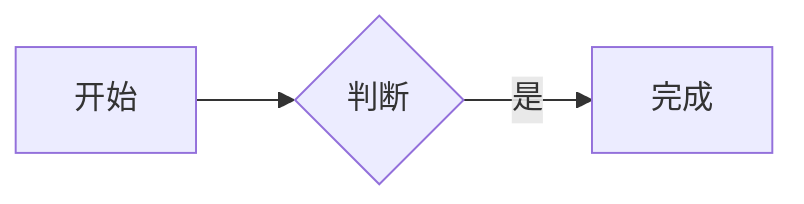

# EasyNote

一个面向个人或小团队的自托管 Markdown 笔记应用。React + TypeScript 前端，pdfmake 生成 PDF、PDF.js 分页预览，Cloudflare Worker API，D1 保存账号与笔记，私有 R2 保存图片与附件。

## 已实现

- 多用户租户模型：初始化管理员、管理员用户管理、默认关闭的审批式注册、恢复代码、账号删除、HttpOnly 会话 Cookie、CSRF、来源检查与登录限流；笔记、版本、附件、离线缓存和 AI 令牌均按用户隔离。
- 笔记新建、独立标题、Markdown 编辑/预览、可勾选待办事项、自动保存、置顶、归档、标签和中文关键词搜索。
- 任务中心聚合所有未完成 Markdown TODO，显示来源笔记和行号，并可直接跳回源码位置。
- 同一账号最多保留一篇完全空白的正常笔记；再次新建时直接打开已有空白笔记。
- CodeMirror 6 编辑器，markdown-it 解析和 DOMPurify 清理，支持脚注、代码高亮和安全 HTML block。
- Mermaid 流程图、脑图及其他 Mermaid 图表在预览模式按需渲染。
- JPEG / PNG / WebP 图片选择、粘贴、拖入；PDF、Markdown、TXT、CSV、JSON 私有附件；文件按光标位置插入。
- PDF 导出支持真实逐页预览、A4/Letter、横竖方向和缩放；桌面端下载，iOS/Android 使用系统分享。
- 回收站、恢复、单篇或全部永久删除，以及防止旧设备重建已清除笔记的墓碑记录；永久删除均需二次确认。
- 修订号并发保护、最后一次操作的幂等重试、冲突副本、有限历史版本和版本恢复。
- 可选的完整离线笔记库：IndexedDB 镜像正文、私有文件、全文搜索和待同步草稿，恢复联网后自动提交。
- 前台轮询与切回页面同步。网络错误停止自动轮询，明确显示错误，由用户重试恢复。
- 可安装 PWA，提供独立窗口、桌面/主屏幕图标、应用外壳离线缓存、离线冷启动和 Share Target 快速收集；从手机分享的标题、文字和 URL 自动进入“收件箱”。
- 常用键盘操作、可搜索命令面板、大纲、稳定内部链接和反向链接。
- 标签重命名、合并、删除，以及笔记批量归档和加标签。
- AI 读写分离接入：受限令牌、FTS5 相关度搜索、批量读取、MCP Resources 和写入工具；AI 修改进入正常版本历史。
- 桌面/手机布局、深浅主题、EasyNote ZIP 导出恢复，以及 Obsidian 目录、通用 Markdown/TXT ZIP、`.md` / `.markdown` / `.txt` 导入和本地链接转换。
- 可撤销、最长 30 天的只读笔记分享链接；分享 Token 只保存哈希，附件访问绑定到分享笔记的当前修订。
- 定时清理过期会话、分享、登录计数、未引用文件、失败上传和已申请删除的租户数据。
- 基于 Miniflare 的真实 Worker/D1/R2 API 测试，以及 Playwright 浏览器测试。

## 项目结构

```text
easynote/
├── src/
│   ├── client/
│   │   ├── App.tsx           # 登录、工作台、设置及各类对话框
│   │   ├── Editor.tsx        # CodeMirror 与安全 Markdown 预览
│   │   ├── useNotebook.ts    # 自动保存、修订冲突、列表及轮询
│   │   ├── drafts.ts         # IndexedDB 草稿、离线镜像与私有文件
│   │   ├── api.ts            # API 调用、错误信息和私有文件上传
│   │   ├── pdf.ts            # 结构化 PDF 生成、分页预览与平台导出
│   │   ├── transfer.ts       # ZIP 导出、校验、文件重映射及导入
│   │   ├── UserManagement.tsx # 管理员用户与注册设置
│   │   ├── NoteSharing.tsx    # 限时只读分享管理
│   │   ├── styles.css
│   │   └── main.tsx
│   ├── worker/
│   │   ├── index.ts          # 请求入口与 Cron
│   │   ├── auth.ts           # 多用户、会话、恢复、管理与登录限流
│   │   ├── features.ts       # 任务中心与限时只读分享
│   │   ├── integrations.ts   # AI 令牌、快照、增量同步和受控写入
│   │   ├── notes.ts          # 笔记、标签、版本、软删除和清除
│   │   ├── images.ts         # 私有文件、配额预留、状态及清理
│   │   └── core.ts           # 配置验证、大小限制、错误及公共类型
│   ├── ai/
│   │   ├── index.ts          # 跨平台 MCP stdio 服务与工具
│   │   ├── client.ts         # 带令牌认证的 EasyNote API 客户端
│   │   └── config.ts         # 交互式本地令牌配置
│   └── shared/types.ts
├── docs/AI_INTEGRATION.md    # 用户与 AI 接入指南
├── migrations/               # 初始 Schema 与后续前向迁移
├── scripts/
│   ├── common.sh             # 环境、锁定依赖、构建与端口检查
│   ├── setup.mjs             # 强制交互式账号初始化
│   ├── maintenance.mjs       # 密码恢复与 D1/R2 灾备
│   └── deploy-config.mjs     # 生成独立生产配置
├── test/                     # API / UI 集成测试及隔离运行时
├── setup.sh                 # 准备本地依赖和账号
├── dev.sh                   # 一键本地启动
├── deploy.sh                # 交互式生产部署入口
├── backup.sh                # 交互式 D1/R2 灾备
├── restore.sh               # 恢复预检与恢复
├── reset-password.sh        # 交互式密码恢复
├── wrangler.json            # 本地模板与显式功能参数
├── vite.config.ts
└── playwright.config.ts
```

## 本地运行

需要安装 Node.js 22.12 或以上版本（自带 npm），支持 macOS / Linux 的 Bash。日常不必直接使用 npm，也不需要全局安装 Wrangler。

```bash
cd easynote
bash dev.sh
```

首次启动会自动准备依赖并交互式创建本地管理员，随后构建、应用本地数据库迁移并启动服务。之后仍然运行同一个命令，不会重复询问账号。默认访问 `http://127.0.0.1:8791`，按 `Ctrl+C` 停止。本地使用模拟 D1 / R2，不访问生产存储。

| 命令 | 用途 |
| --- | --- |
| `bash setup.sh` | 只准备依赖和本地账号，不启动服务 |
| `bash dev.sh` | 一键本地启动，缺少账号配置时自动初始化 |
| `bash dev.sh --port 8793` | 显式指定其他本地端口 |
| `bash deploy.sh` | 交互式生产部署 |
| `bash deploy.sh --check` | 仅本地构建与部署预检，不登录、不修改云资源 |
| `bash reset-password.sh --local` | 交互式选择并重置本地账号，撤销该账号会话和 AI 令牌 |
| `bash reset-password.sh --remote` | 交互式选择并重置生产账号；重置初始管理员时同步初始化验证器 |
| `bash backup.sh --remote` | 创建并校验完整 D1/R2 灾备 |
| `bash restore.sh <目录> --remote --check` | 只执行恢复预检 |
| `bash restore.sh <目录> --remote` | 恢复至空的 D1/R2 资源 |
| `npm run ai:setup` | 交互式配置 MCP 地址和令牌 |
| `npm run ai:mcp` | 启动本地 MCP stdio 服务 |

三个入口都支持 `--help`，也可从任意目录通过脚本路径执行。端口已占用时会报错，不终止已有进程、不悄悄换端口。

依赖按 `package-lock.json` 使用 `npm ci --include=dev` 安装；首次使用脚本，或依赖清单、锁文件、Node 主版本、系统架构变化时会重新安装，其余启动跳过安装。安装记录保存在 `node_modules` 内，不进 Git。脚本不会自动安装系统 Node.js；缺少环境时会给出明确提示。

账号初始化、生产部署、密码恢复和灾备写操作必须在交互式终端执行，密码输入隐藏。脚本保存盐和 PBKDF2/HMAC 验证器，不保存明文密码。`.dev.vars` 被 Git 忽略且权限为 `0600`，仍应作为敏感文件保护。已有有效配置直接保留；配置损坏时停止并提示，不自动覆盖。

首次会话请求根据初始化验证器创建管理员；未配置时没有默认密码，也不开放网页抢注。管理员可在“设置 → 用户与注册”创建用户或开启自助注册；自助注册账号默认禁用，必须经过管理员批准。重复执行 setup 不会更改数据库中已有账号的密码。修改初始化文件后应重启开发服务。

`dev.sh` 每次启动都会检查并构建前端；修改前端源码后重启即可。需要热更新时，可在默认 8791 服务启动后另开终端运行 `npm run dev:client`，访问 `http://127.0.0.1:5174`。只有本地命令允许环回 HTTP，生产要求 HTTPS。原来的 `npm run setup`、`npm run dev`、`npm run deploy` 仍可使用，它们只是调用相同脚本。

## PWA 安装与离线范围

生产环境通过 HTTPS 部署后，Chromium 浏览器可使用地址栏安装入口；登录后的“设置”中也会在浏览器允许时显示“安装 EasyNote”。Safari / iOS 使用系统分享菜单中的“添加到主屏幕”。

安装后的 PWA 可作为系统分享目标。从其他应用分享网页、标题或文字时，EasyNote 创建带“收件箱”标签的笔记；若会话尚未登录，分享参数会保留到登录成功后再收集。Share Target 使用同源 GET 启动，不接收文件，也不会绕过账号认证。

Service Worker 只预缓存应用外壳，不缓存 `/api`、登录会话、笔记正文或私有文件；PDF 引擎和中文字体首次使用时按需缓存，启用离线笔记库时会主动预热。用户可在“设置 → 离线笔记库”显式启用按账号隔离的 IndexedDB 镜像；启用后会增量保存全部笔记和引用文件，支持离线冷启动、全文搜索、阅读、编辑和 PDF 导出。断网修改进入待同步队列，恢复有效会话后按原 revision 和 operationId 自动提交；冲突仍进入显式冲突处理。

退出登录或执行全端登出会删除该账号在当前浏览器中的离线正文、文件和草稿。关闭离线笔记库只删除镜像及缓存文件，未同步草稿仍保留。浏览器存储受设备可用空间和站点配额约束。

远程改密或全端登出无法擦除一台当前断网设备上已存在的副本；该设备最多可离线访问到原会话固定到期时间，联网收到撤销结果后立即失效。因此离线镜像的设备安全仍依赖系统账号、屏幕锁和磁盘加密。

## 账号安全

设置中的“账户安全”支持验证当前密码后修改密码、生成一次性显示的恢复代码、全端登出和删除自己的账号。改密保留当前会话，撤销其他浏览器会话和全部 AI 令牌；恢复代码使用后立即失效。忘记密码可在登录页使用恢复代码，或运行 `reset-password.sh`；脚本要求显式选择本地或生产，在多用户库中选择账号、隐藏输入并进行文字确认。

管理员可创建、批准、启停、改名、改角色、重置密码或删除其他用户，但不能禁用、降级或删除自己，也不能移除最后一个可用管理员。删除账号先立即撤销 Cookie 与 AI 访问并将 R2 对象标记为删除，再由定时清理批量删除对象和该租户的 D1 数据。

每个用户就是独立租户。服务端对笔记、版本、同步游标、墓碑、文件、分享和 AI Token 的查询都带 `user_id`；R2 Key 使用 `<user_id>/<file_id>`。浏览器 IndexedDB、编辑锁和缓存同样按用户 ID 分区。

## 灾备

网页“导出 ZIP”用于迁移当前笔记；“导出草稿”只保护当前浏览器里的未同步内容。真正的灾难恢复使用 `backup.sh`：完整导出 D1 中的账号、笔记、历史、墓碑和令牌状态，再根据该数据库快照下载 R2 对象并逐个验证大小和 SHA-256。派生的全文索引不进入备份，在恢复笔记时自动重建。

`restore.sh --check` 会验证备份清单、数据库、对象、当前迁移版本以及目标 D1/R2 是否为空，不写入数据。正式恢复先上传 R2，再导入 D1；任何非空目标都会被拒绝。详细流程见 [`docs/DISASTER_RECOVERY.md`](docs/DISASTER_RECOVERY.md)。

## AI 接入

EasyNote 的 AI 接入采用独立权限：MCP 读取工具直接搜索和读取 EasyNote API；创建、修改、归档和移入回收站使用可写令牌。AI 无法永久删除笔记，也不持有浏览器 Cookie 或账号密码，不在本地复制笔记正文。

在 PWA“设置 → AI 接入”中创建令牌后，执行：

```bash
npm run build
npm run ai:setup
```

设置程序会输出可直接加入 AI 客户端的 MCP 配置。完整的 macOS、Windows、Linux 接入步骤、工具清单、安全约束和故障排查见 [`docs/AI_INTEGRATION.md`](docs/AI_INTEGRATION.md)。

## 部署到 Cloudflare

1. 在 Cloudflare 创建独立 D1 数据库，例如 `easynote-db`。
2. 创建独立且不公开的 R2 桶，例如 `easynote-images`。
3. 在本项目目录运行：

```bash
bash deploy.sh
```

脚本自动准备依赖、检查并构建，然后询问数据库 UUID、桶名、Worker 名和执行确认，再通过 Wrangler 交互式浏览器登录。执行远程迁移并部署后，检查远端 `INITIAL_OWNER` 是否存在：存在则保留，缺少才交互式初始化。首次部署在安装验证器前保持不可登录；中途失败可重新执行同一命令，不静默重试。

- 后续部署展示已保存的 Worker、D1、R2，确认复用后不必重新输入；修改配置则重新填写。构建检查失败时不会登录或执行云端变更。
- 不接受环境变量中的 Cloudflare API Token / API Key（包括 `CF_*` 别名），使用当前用户的 Wrangler 浏览器登录流程，不读取 EasyDrop 的项目凭据。
- 生成的 `wrangler.deploy.json` 被 Git 忽略；不要将模板中的全零 UUID 用于生产。
- 应用参数在 `wrangler.json` 维护。复用部署时重新从模板生成生产配置，仅继承已保存的资源标识和可选 `account_id`；不把生成文件当作应用参数的编辑入口。
- 不会自动创建云资源或配置域名。自定义域名可在 Cloudflare 中绑定。
- 更换 Cloudflare 账号或存储资源前，自己核对资源归属并备份。
- 更新部署会应用 D1 migrations，不覆盖已有初始账号验证器，也不会重置已有账号密码。

## 关键行为

### 保存与冲突

每次保存提交 `revision` 和随机 `operationId`。服务端在 D1 事务中校验旧修订号、更新笔记、按内容变化记录新版本并维护文件引用。所有字段均未变化时按保存成功返回，但不递增修订号。单独置顶或取消置顶仍递增技术修订号并参与多端同步，但不生成编辑历史；恢复历史版本也保留当前置顶状态。历史列表会折叠旧版本遗留的连续重复记录。只有写入成功才能显示“已保存到云端”。

“全部笔记”只显示未归档内容，并继续将置顶笔记排在前面；归档笔记仅在“归档笔记”视图中出现。置顶和归档是彼此独立的属性。

请求期间继续输入会生成下一份草稿，不能被较早的保存响应清空。当前修订冲突返回 `409` 和服务器版本；本地草稿仍保留，用户可创建新的“冲突副本”，原云端笔记不被覆盖。永久删除后的旧设备保存返回 `410`。

同一个浏览器配置文件、同一账号只允许一个编辑标签页，使用 Web Locks 防止两个页面覆盖同一份本地草稿。关闭原页后可在新页重新打开。跨设备、跨浏览器的并发由服务端修订号处理。

普通网络失败可手动重试；启用离线笔记库后，断网草稿会在恢复联网和会话后自动重试。尚有草稿时禁止退出登录，并注册页面离开提示；浏览器不能保证所有离开场景都会显示提示。

### 快捷键与知识链接

`Cmd/Ctrl+K` 打开快速跳转，可执行新建、保存、搜索、编辑/预览切换、置顶、归档、历史、大纲、内部链接、PDF 导出和设置，也可搜索笔记。命令和笔记列表支持方向键移动焦点及 `Enter` 执行。

| 快捷键 | 操作 |
| --- | --- |
| `Cmd/Ctrl+S` | 立即保存并同步 |
| `Ctrl+E` / `Cmd/Ctrl+Enter` | 切换编辑与预览，并保留源码光标位置 |
| `Cmd/Ctrl+B` / `Cmd/Ctrl+I` | 在编辑器中切换粗体 / 斜体 |
| `Cmd/Ctrl+P` | 导出当前笔记为 PDF |
| `Cmd/Ctrl+/` | 查看快捷键 |
| `Esc` | 关闭弹窗 |

内部链接采用稳定格式 `[[笔记 UUID|显示标题]]`，通过“插入内部链接”选择目标生成。链接以 UUID 定位，因此目标改名后仍可打开；显示文字不会自动改写。笔记导航面板从 Markdown 标题生成大纲，并列出所有未删除笔记中的反向链接。

预览中的标题、段落、列表项、表格和代码块可双击切回对应的 Markdown 源码位置。脚注使用 `正文[^说明]` 和 `[^说明]: 脚注内容`；带语言标识的 fenced code block 会按需加载高亮器，未知语言保持纯文本显示。

### 标题层级

应用已提供独立的笔记标题栏，标题建议直接写文字，不添加 Markdown 的 `#`。正文不重复笔记标题：大章节从 `##` 开始，子章节使用 `###`，继续按层级递进。单独导入 Markdown/TXT 时仍可使用标准的 `# 标题` 首行，导入程序会去除 `#` 后提取为笔记标题。

### 待办事项

使用 `- [ ] 待办内容` 创建未完成事项，使用 `- [x] 已完成内容` 标记完成；同时兼容 `- [] 待办内容` 简写。预览模式可直接勾选，修改会回写 Markdown 并正常保存。

侧栏“任务中心”汇总当前租户全部未删除笔记中的未完成事项，包括归档笔记，并忽略 fenced code block 中的示例语法。每项显示来源笔记和源码行号，点击后切换到编辑模式并将 CodeMirror 光标定位到对应列表行。

### 限时只读分享

已保存的正常笔记可创建 1 小时、1 天、7 天或 30 天的只读链接。每篇笔记同时只有一个有效链接；创建新链接会替换旧链接，用户也可随时撤销。将笔记移入回收站、禁用/删除所属账号或链接过期都会立即阻止访问。

原始分享 Token 只在创建时返回，D1 仅保存 SHA-256。公开读取接口只返回标题、正文、标签、更新时间和到期时间；图片与附件必须同时满足 Token 有效、文件属于该笔记当前 revision、文件仍为 ready。响应统一 `no-store`，分享页没有编辑、历史、反向链接或租户浏览入口。

### 文档宽度

桌面端默认使用最大 900px 的阅读宽度，可通过工具栏切换至最大 1080px 的宽屏模式；可用空间低于上限时自动占满。宽度选择保存在浏览器本地，标题、正文、表格、图片和 Mermaid 图表始终共享同一内容宽度。

### 图表与 HTML

流程图和脑图使用 Mermaid fenced code block，在预览模式渲染：

````text

````

脑图将首行改为 `mindmap` 并按缩进编写节点。HTML block 可直接写入 Markdown；脚本、事件属性、内联样式、表单、iframe、嵌入对象和外部媒体会被清除，HTML 外部图片仍不会加载。图表会使用紧凑间距并缩放至正文宽度以内；单篇最多渲染 20 个 Mermaid 图表，每个源码最多 50000 字符。

可直接在应用中导入 [`examples/mermaid-html-demo.md`](examples/mermaid-html-demo.md) 验收流程图、脑图和 HTML block。

### 图片与附件

- 原图上传，不进行有损压缩或 EXIF 清除。敏感拍摄位置等元数据需要上传前自行移除。
- 浏览器尝试解码；服务端通过成熟图片解析库检查格式头与宽高，并校验大小、类型及像素数。不是杀毒或完整图片转码服务。
- 只展示当前服务的私有图片；Markdown 外部图片不会自动加载，避免访问跟踪。
- 正文使用 `/api/images/<id>` 稳定引用，无公开桶地址或临时签名 URL。
- 每次读取都检查登录和所属账号，响应为 `private, no-store`。
- 配额预留和发布状态为 `pending → ready → deleting`。上传和数据库不是跨服务事务，失败对象由清理任务补偿。
- PDF 通过文件头和结束标记校验；Markdown、TXT、CSV、JSON 必须为 UTF-8。非图片文件强制以附件下载并设置 `nosniff`。
- 当前正文、回收站及保留的历史版本引用的文件不会被清理。没有任何引用且最后使用时间超过宽限期的对象才进入清理。
- 不提供公开文件目录、缩略图转码、杀毒、去重或大文件分片续传；只有有效笔记分享 Token 可读取当前正文实际引用的文件。

### 导出与导入

ZIP v2 包含 `manifest.json`、`notes/*.md` 和所引用的 `files/*`。Markdown 图片和附件引用转换为相对路径，解压后可直接阅读。笔记文件优先使用标题命名；无标题时使用 `未命名.md`，重名时自动追加序号，稳定 ID 仅保留在清单中。

单篇笔记可通过工具栏按钮或 `Cmd/Ctrl+P` 导出 PDF。导出窗口提供最终文件的逐页预览，并支持调整文件名、A4/Letter 纸张、横竖方向和缩放比例；设置变化后会按实际 PDF 重新分页。应用通过结构化排版生成文字可搜索、可复制的 PDF，不使用整页截图或浏览器打印，因此不会附带笔记标题、更新时间、标签以及浏览器生成的日期、URL、页码。桌面端直接下载，iOS 和 Android 优先打开系统保存/分享面板，不支持文件分享时回退为浏览器下载。

- 导出范围包括正常和回收站笔记，不包含账号、密码、会话、历史版本、本机草稿或无引用图片。
- 导出读取每篇笔记当时的内容，不是跨设备写入下的全库事务快照。备份期间建议暂停其他设备编辑。
- 单次浏览器导入/导出限制为 64 MiB 未压缩内容、1200 个文件，定义在 `src/client/transfer.ts`。
- EasyNote ZIP 导入先检查清单、尺寸、路径、重复条目、文件 SHA-256 及引用完整性，再按正文全文查重，仅上传非重复笔记实际引用的文件。
- 外部导入支持 Obsidian Markdown 目录、通用 Markdown/TXT ZIP、单个或多个 `.md` / `.markdown` / `.txt`。可从 YAML frontmatter 提取 `title` 和 `tags`，将 Wiki 链接、Wiki 嵌入和相对 Markdown 笔记链接改写为 EasyNote 稳定链接。
- 外部导入会按原目录解析 JPEG、PNG、WebP、PDF、Markdown、TXT、CSV 和 JSON 引用并上传；HTTP(S) 外链保持原文，路径逃逸、重复路径、非 UTF-8 正文和超限内容会终止导入。不支持 Obsidian 插件私有数据或 ENEX 等专有格式。
- 非重复笔记会创建新 ID 并重写文件引用，不覆盖现有内容；正文完全一致或完全空白的笔记会跳过，并在结果中显示数量。
- 导入不是全库原子事务。失败会报告已成功导入数量；无引用的已上传文件由宽限期清理。

## 配置

所有服务器参数均在 `wrangler.json` 的 `vars` 中显式配置，使用时校验类型和范围。

| 参数 | 默认值 | 含义 |
| --- | --- | --- |
| `MAX_NOTE_BYTES` | 262144 | 单篇正文 256 KiB |
| `MAX_IMAGE_BYTES` | 8388608 | 单张图片 8 MiB |
| `MAX_IMAGE_PIXELS` | 40000000 | 单张最多 4000 万像素 |
| `MAX_ATTACHMENT_BYTES` | 20971520 | 单个附件 20 MiB |
| `IMAGE_QUOTA_BYTES` | 1073741824 | 每账号 R2 文件总配额 1 GiB，含待清理文件 |
| `MAX_NOTES` | 5000 | 每账号笔记上限，含回收站 |
| `VERSIONS_KEPT` | 20 | 每篇保留版本数，包含当前版本 |
| `IMAGE_GRACE_HOURS` | 168 | 未引用图片最后使用后的宽限期 |
| `SESSION_DAYS` | 30 | 会话固定有效天数，不做每请求续期 |
| `AUTOSAVE_MS` | 1000 | 停止输入后的保存延迟 |
| `POLL_SECONDS` | 30 | 前台同步检查间隔 |
| `LOGIN_WINDOW_SECONDS` | 900 | 登录尝试计数窗口 |
| `LOGIN_IP_LIMIT` | 20 | 每 IP 窗口内登录预算 |
| `LOGIN_GLOBAL_LIMIT` | 200 | 实例窗口内登录预算 |
| `ACCOUNT_WINDOW_SECONDS` | 900 | 注册和恢复请求计数窗口 |
| `REGISTRATION_IP_LIMIT` | 5 | 每 IP 窗口内注册预算 |
| `REGISTRATION_GLOBAL_LIMIT` | 50 | 实例窗口内注册预算 |
| `PASSWORD_RESET_IP_LIMIT` | 5 | 每 IP 窗口内恢复预算 |
| `PASSWORD_RESET_GLOBAL_LIMIT` | 50 | 实例窗口内恢复预算 |
| `ALLOW_LOCAL_HTTP` | false | 仅本地命令开启环回 HTTP |

标题 256 字符、标签最多 20 个且每个 40 字符、单篇最多引用 80 个私有文件，这些校验位于 `src/worker/notes.ts`。不是 Cloudflare 平台通用限制。

## API

| 方法 / 路径 | 功能 |
| --- | --- |
| `GET /api/session` | 账号状态、CSRF、客户端参数 |
| `POST /api/login` | 登录 |
| `POST /api/register` | 注册待管理员批准的普通用户 |
| `POST /api/account/reset-password` | 使用一次性恢复代码重置密码 |
| `POST /api/logout` | 撤销当前会话 |
| `POST /api/account/password` | 修改密码并撤销其他会话 |
| `POST /api/account/logout-all` | 验证密码后撤销全部会话 |
| `POST /api/account/recovery-code` | 验证密码后生成新的恢复代码 |
| `DELETE /api/account` | 验证用户名和密码后申请删除当前租户 |
| `GET/POST /api/admin/users` | 管理员列出或创建用户 |
| `PATCH/DELETE /api/admin/users/:id` | 管理员更新或删除其他用户 |
| `PATCH /api/admin/settings/registration` | 开关自助注册 |
| `GET /api/sync` | 按单调序号增量同步完整笔记和删除记录 |
| `GET /api/tasks` | 汇总未完成 TODO 及源码位置 |
| `GET /api/notes` | 列表、搜索、视图、标签筛选，50 条分页 |
| `POST /api/notes/:id` | 创建笔记，revision 必须为 0 |
| `GET /api/notes/:id` | 读取完整正文 |
| `PUT /api/notes/:id` | 按 revision 更新 |
| `DELETE /api/notes/:id` | 永久删除指定 revision 的回收站笔记 |
| `GET /api/notes/:id/versions` | 历史版本，恢复通过普通更新提交 |
| `GET /api/notes/:id/backlinks` | 查询未删除笔记中的反向链接 |
| `GET/POST/DELETE /api/notes/:id/share` | 查询、创建/替换或撤销限时分享 |
| `GET /api/public/shares/:token` | 无需登录读取有效只读分享 |
| `GET /api/public/shares/:token/(images\|files)/:id` | 读取分享笔记当前版本引用的文件 |
| `GET /api/tags` | 标签列表 |
| `PUT /api/images/:id` | 上传原始图片字节，使用 `X-Filename` |
| `GET /api/images/:id` | 鉴权读取图片 |
| `PUT/GET /api/files/:id` | 上传或鉴权下载 PDF/文本附件 |
| `GET/POST /api/integrations/tokens` | 列出或创建 AI 接入令牌 |
| `DELETE /api/integrations/tokens/:id` | 撤销 AI 接入令牌 |
| `GET /api/integrations/notes` | 使用 Bearer 令牌执行全文搜索和相关度排序 |
| `GET /api/integrations/notes/batch` | 使用 Bearer 令牌批量读取最多 20 篇笔记 |
| `GET /api/integrations/notes/:id` | 使用 Bearer 令牌读取完整笔记 |
| `POST/PUT /api/integrations/notes/:id` | 使用可写令牌创建或按 revision 更新笔记 |

所有数据接口按账号隔离。浏览器写接口要求同源 `Origin` 与 `X-CSRF-Token`；AI 接口要求独立 Bearer 令牌且不开放 CORS。客户端错误详情包含 HTTP 方法、路径、状态和完整 JSON 正文，不记录密码、Cookie 或令牌。

## 验证

```bash
bash deploy.sh --check
npm run build
npm test
npm run test:ai
npm run test:scripts
npx playwright install chromium
npm run test:ui
```

API 测试使用内存 D1 / R2；浏览器测试自动在 `127.0.0.1:8792` 启动独立临时实例。测试账号、Cookie 和图片只存在于测试环境，不是生产默认凭据。

脚本流程测试使用临时目录和模拟 npm / Wrangler，不登录 Cloudflare、不修改本地账号、不访问真实云端资源。交互测试通过系统 `expect` 创建伪终端，macOS 通常自带；Linux 运行这组测试前需安装 `expect`。日常初始化、启动和部署不依赖它。

测试覆盖多用户租户隔离、注册审批、恢复与账号删除、任务定位、Share Target、限时分享、Obsidian ZIP、账号改密与全端登出、离线冷启动和回传、AI 令牌、真实 MCP、幂等与并发、搜索、批量标签、双链、删除墓碑、历史、私有文件、灾备校验、移动布局和编辑锁。

## 当前边界

- 离线镜像不加密，安全边界与浏览器配置文件和设备账号一致；敏感设备应启用系统磁盘加密。
- 不内置生成式 AI、多人实时协同编辑、图谱或自动定时远程备份。只读分享针对单篇笔记，不提供公开目录、搜索或可写协作；AI 只能通过用户主动创建的受限令牌和本地 MCP 桥接器访问所属租户。
- AI 关键词搜索采用 FTS5 trigram 索引和 BM25 排序，并通过参数化 `LIKE` 保证连续子串精确命中；少于 3 个字符时回退到 `LIKE`。目前不包含语义向量检索。
- 列表使用 offset 分页而非数据库快照；其他设备新增内容可能移动页边界，手动刷新重新获取。
- 历史版本数量有限；完整灾难恢复依赖显式运行并离线保管的 D1/R2 备份。
- 不提供端到端加密，Cloudflare 账号管理员可访问存储内容；使用成本取决于实际请求、存储和套餐，不保证永久免费。
- 尚未实际部署云端；生产前应使用自己的临时实例验证账号配置、备份恢复和 Cloudflare 用量。
