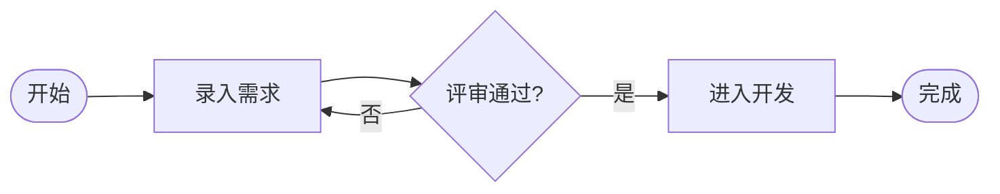
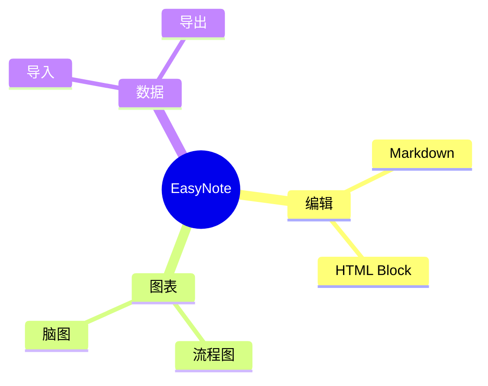

# EasyNote 图表与 HTML 验收

## 流程图

## 脑图

<section>
  <h2>HTML Block</h2>
  
这是一段由 <strong>HTML</strong> 渲染的内容，支持 <mark>高亮</mark>、<kbd>快捷键</kbd> 和常用结构标签。

  

    
展开内容

    
脚本、事件属性、内联样式、iframe、表单和外部媒体会被安全过滤。

  

  <table>
    <thead>
      <tr><th>能力</th><th>状态</th></tr>
    </thead>
    <tbody>
      <tr><td>流程图</td><td>支持</td></tr>
      <tr><td>脑图</td><td>支持</td></tr>
      <tr><td>HTML Block</td><td>安全子集</td></tr>
    </tbody>
  </table>
</section>
