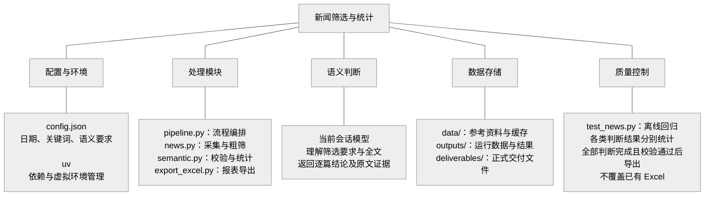

# 新闻筛选与统计

一个使用 uv 管理的纯 Python 脚本项目：4 个运行模块、1 个测试文件。
没有 Web 服务、数据库或独立模型服务，阶段之间通过 JSON 文件衔接。

```text
指定发布日期和关键词 → 去重后的粗筛池 → 当前会话模型理解全文 → 统计与 Excel
```

## 导航

- [架构脑图](#架构脑图)
- [环境](#环境)
- [配置](#配置)
- [使用](#使用)
- [目录结构](#目录结构)
- [代码结构](#代码结构)
- [调用链与数据流](#调用链与数据流)
- [输出与统计](#输出与统计)
- [维护与验证](#维护与验证)
- [覆盖边界](#覆盖边界)

## 架构脑图

脑图按职责自上而下展开，处理阶段通过 JSON 文件交换数据：



连线表示职责归属，不表示执行顺序或自动调用关系。Python 脚本不调用模型；
语义判断由当前会话模型执行，未经用户明确同意不得切换模型。
`semantic.py` 仅负责准备输入、校验写回结果及汇总统计。
各模块职责和执行顺序分别见[代码结构](#代码结构)与[调用链与数据流](#调用链与数据流)。

## 环境

项目统一使用 **uv**，Python 版本由 `.python-version` 指定，依赖由
`pyproject.toml` 和 `uv.lock` 管理，虚拟环境位于项目 `.venv/`。

```sh
uv sync --locked
uv run --locked src/test_news.py
```

不要使用系统 Python、共享虚拟环境、pip 或 Node 运行项目。增加依赖使用 `uv add`。
如果终端已激活其他虚拟环境，先退出该环境；双击入口会自动清除环境路径覆盖。

直接依赖只有两项：`beautifulsoup4` 解析 HTML，`openpyxl` 生成 Excel。
`pyproject.toml` 设置 `package = false`，项目不打包发布，也不需要安装自己。

## 配置

日常只修改根目录 `config.json`：

```json
{
  "start": "2025-09-01",
  "end": "2026-08-31",
  "keywords": {
    "title": ["创新", "创业", "科技园"],
    "content": ["创新创业", "挑战杯", "成果转化"]
  },
  "topic": "收集本校学生创办公司并实际经营的成果；排除仅发布竞赛通知、讲座和报名宣传的文章。信息不足时待确认。"
}
```

- 日期包含两端，使用发布日期，不使用正文中的活动日期。
- `title` 只匹配标题；`content` 匹配标题和正文。任一关键词命中即进入粗筛池。
- 关键词是普通文本，英文不区分大小写；两组至少一组非空。
- `topic` 描述真正想找的文章，包括收录条件、排除条件及拿不准时的处理方式。

关键词只负责粗筛，最终收录由语义判断决定，不追加隐藏的标题规则。
粗筛漏掉的文章不会再进入语义判断，因此关键词应优先保证召回。

## 使用

### 1. 准备粗筛池

```sh
uv run --locked src/pipeline.py prepare --output outputs/my-run
```

双击 `开始采集.command` 也会执行此步骤，自动创建独立目录。
这一步不调用模型，只采集、粗筛并生成 `judge/` 下的全文分片，默认每片 10 篇。

常用参数：`--config` 更换配置，`--start` / `--end` 覆盖日期，
`--source` 限定栏目（可重复），`--refresh` 刷新缓存，
`--max-pages` 限制每栏目页数，`--full-history` 关闭日期提前停止，
`--batch-size` 设置分片篇数。

已有原始文章时，可以离线重新筛选，不复用旧判断：

```sh
uv run --locked src/pipeline.py prepare --from-run outputs/current --output outputs/new-run
```

日期及栏目必须落在原采集范围内；原始数据的缺项会保留。
同目录重新 `prepare` 须使用相同配置和参数，不重抓或重排分片；
采集中断可继续。改配置请使用新目录。

### 2. 当前模型做语义判断

**默认只用当前会话模型，不针对任何模型或产品单独禁用。**
未经用户明确同意，不调用其他模型、另一个 AI CLI 或外部模型 API，
失败或额度不足时也不自动切换。不能确认委派使用相同模型时，留在当前会话处理。

在当前 AI 会话中提出：

```text
按 outputs/my-run/judge/INSTRUCTIONS.md，逐篇理解各 chunk 的全文和 topic，
把判断写入对应 judged 文件，然后执行 finish。仅使用当前会话模型。
```

每篇返回结论、主题、理由及逐字原文证据。正文缺失时必须待确认。
脚本负责准备和校验数据，不会自行启动模型；结构校验不代表模型判断一定正确。

### 3. 统计与导出

```sh
uv run --locked src/pipeline.py finish outputs/my-run

# 指定交付位置
uv run --locked src/pipeline.py finish outputs/my-run --excel deliverables/我的台账.xlsx
```

`finish` 只读取本轮冻结数据和判断，不联网或重新粗筛。
漏判、重复 ID、其他轮次结果、无效字段或非原文证据会阻止成品导出；
补齐或修正后重跑即可。已有 Excel 拒绝覆盖，需要新文件名。

## 目录结构

```text
innovation_news/
├── config.json              日期、关键词、语义筛选要求
├── pyproject.toml           Python 依赖声明
├── uv.lock                  依赖版本锁定
├── .python-version          Python 版本，目前为 3.12
├── .venv/                   uv 管理的项目虚拟环境
├── .git/                    Git 版本记录
├── .gitignore               虚拟环境、缓存和运行产物的忽略规则
├── AGENTS.md                AI 协作、模型使用和环境约束
├── README.md                使用说明和架构文档
├── 开始采集.command         macOS 双击入口
├── src/
│   ├── pipeline.py          命令入口与流程编排
│   ├── news.py              配置、采集、解析、去重和关键词粗筛
│   ├── semantic.py          语义任务准备、判断校验和统计
│   ├── export_excel.py      Excel 导出
│   └── test_news.py         离线回归测试
├── data/
│   ├── 人工筛选版/          人工参考 Excel
│   └── news_cache/pages/    按 URL 缓存的原始网页
├── outputs/
│   └── current/             保留的当前运行数据
└── deliverables/            正式交付件
```

三个数据目录用途不同：

- `data/` 是参考资料与缓存。人工参考表目前不参与自动筛选，不会隐式改变结果。
- `outputs/` 是每轮运行的工作目录，承载原始文章、冻结配置、判断任务和结果。
- `deliverables/` 是交付目录。只有指定 `finish --excel deliverables/文件名.xlsx` 才写入，不会自动复制。

`.venv/`、`outputs/`、网页缓存和 Python 字节码不入库。
不保留废弃实现、历史实验工具或重复运行备份。
`current` 只是目录名，不是自动追踪最新批次的指针；实际进度以其中的 `summary.json` 为准。

## 代码结构

模块采用普通函数组织，不引入服务层、仓储层或插件框架。
`pipeline.py` 调用其他三个模块；`semantic.py` 复用 `news.py` 的 JSON 读写函数；
`export_excel.py` 只接收结果数据，不依赖采集和模型判断逻辑。

### pipeline.py：流程编排

[源文件](src/pipeline.py)。只负责串联步骤，不判断文章是否符合业务要求。

| 函数 | 职责 |
|---|---|
| `main()` | 解析 `prepare`、`finish` 及参数；不带参数时默认执行 `prepare` |
| `collect()` | 依次采集栏目，每完成一个栏目保存断点，续跑时跳过已保存栏目 |
| `reuse()` | 从已有运行读取原始文章，校验日期与栏目范围，不复用旧语义判断 |
| `prepare()` | 校验配置，采集或复用，按日期筛选、去重、关键词粗筛，冻结输入并准备分片 |
| `finish()` | 合并校验判断，确认全部完成后调用 Excel 导出 |
| `print_summary()` | 展示各阶段数量及采集缺项，不另算一套统计口径 |

`prepare` 使用当前配置；`finish` 使用本轮冻结快照，不读取后来修改的根配置。
采集断点以栏目为单位，不是逐页断点。

### news.py：采集与粗筛

[源文件](src/news.py)。负责建立粗筛池，不执行语义判断、不导出报表。

| 函数或常量 | 职责 |
|---|---|
| `SOURCES` | 定义学校 12 个公开栏目，可通过 `--source` 选择 |
| `load_config()` | 校验日期、关键词、`topic` 和未知配置项，清理关键词空白并去重 |
| `fetch()` | 下载 HTML、处理编码并缓存；列表缓存 1 小时，详情缓存 30 天 |
| `parse_listing()` | 提取列表中的标题、链接、日期和下一页地址 |
| `parse_detail()` | 提取明确标注的发布日期、标题和正文，去除脚本及样式 |
| `crawl_source()` | 遍历单个栏目，每页正文最多四路并发读取，记录缺项和停止原因 |
| `article_key()`、`merge_articles()` | 按学校文章 ID 去重，其他链接按规范化 URL 去重，合并来源与链接 |
| `coarse_filter()` | 任一配置关键词命中即保留，记录 `keyword_hits`，不追加语义排除规则 |
| `read_json()`、`write_json()` | JSON 读写；写入先使用临时文件，再替换目标文件 |

日期使用列表日期或详情页明确的发布日期，不猜正文事件日期。
列表日期已在区间外的条目通常不下载正文；读取详情后发现日期不同，则优先采用详情日期并保留说明。
跨栏目重复文章不会因为出现多次而重复计入总数；不同 ID 的同标题文章不会被直接合并。

### semantic.py：任务、校验与统计

[源文件](src/semantic.py)。**此模块不是模型客户端，本身不执行语义理解。**

| 函数或常量 | 职责 |
|---|---|
| `INSTRUCTIONS` | 定义当前模型使用约束、判断原则、证据要求和输出格式 |
| `fingerprint()` | 根据配置快照和粗筛池生成 SHA-256 运行指纹 |
| `load_run()` | 检查格式版本、运行指纹及粗筛池 ID 是否重复 |
| `batches()` | 将全文文章按固定顺序分批，默认每片 10 篇 |
| `prepare_batches()` | 写入分片与说明；已有分片必须与预期一致，不重新编号 |
| `validate()` | 检查运行 ID、分片编号、ID 完整性、结论、主题、理由及逐字证据 |
| `merge()` | 收集已写回分片并校验，记录缺失分片，更新结果和汇总 |
| `summarize()` | 区分符合、不符合、待确认、未判断，汇总符合项的月份、主题和来源 |

模型每篇返回 `id`、`decision`、`category`、`reason`、`evidence`。
`decision` 只能是“符合”“不符合”“待确认”；正文缺失必须待确认；
符合项必须有原文证据，其他结论可以不提供证据，但提供的证据同样必须逐字连续匹配。
无效判断会报错，不覆盖此前有效统计；缺失分片则允许更新进度，但阻止成品导出。

### export_excel.py：结果呈现

[源文件](src/export_excel.py)。只消费已经汇总的结果，不重新筛选或改变判断。

| 函数 | 职责 |
|---|---|
| `article_rows()` | 将文章与判断字段整理为工作表列，汇总命中关键词 |
| `add_sheet()` | 设置表头、列宽、换行、筛选、冻结窗格，按字面量写入外部文本 |
| `export_excel()` | 检查语义完成状态，生成六张工作表及原文超链接，拒绝覆盖已有文件 |

六张表分别为：统计、新闻台账、待确认、全部判断、来源与缺项、采集配置。
新闻台账仅包含符合项，待确认单独列出。Excel 单元格文本超长时明确报错，
不静默截断；完整数据仍在 JSON 中。导出不依赖 Node 或系统 Python。

### test_news.py：离线回归

[源文件](src/test_news.py)。使用标准库 `unittest`，包括两组测试：

- `PipelineTests`：完整流程、统计、结果校验、输入变更、日期覆盖、离线复用、断点续跑、Excel 边界。
- `ParsingTests`：日期与正文解析、列表分页、跨栏目去重、关键词匹配、采集失败状态。

测试使用模拟网页与判断结果，不联网、不调用模型，不验证真实模型准确率。

## 调用链与数据流

### 1. prepare：从配置到判断任务

```text
pipeline.main()
  → news.load_config()
  → pipeline.collect() → news.crawl_source() → fetch / parse_listing / parse_detail
    或 pipeline.reuse() → 已有运行的 raw_articles.json
  → 按发布日期过滤
  → news.merge_articles()
  → news.coarse_filter()
  → 写入 raw_articles.json / coarse.json / run.json
  → semantic.prepare_batches() → INSTRUCTIONS.md / chunk_*.json
  → semantic.merge() → 更新已有判断进度
```

此阶段不会将命中关键词视为“符合”，也不会自动启动任何模型。

### 2. 当前会话模型：从全文到逐篇结论

```text
judge/INSTRUCTIONS.md + chunk_*.json 中的 topic 和文章全文
  → 当前会话模型理解收录条件、排除条件及文章主体
  → 写入对应的 judged_*.json
```

模型可以依据语义排除关键词命中的文章，但不能从粗筛池外补入文章。
更换语义要求后应创建新运行，避免混用不同要求下的判断。

### 3. finish：从判断到统计与 Excel

```text
pipeline.finish()
  → semantic.merge()
      → load_run() 核对冻结输入
      → validate() 校验已完成分片
      → summarize() 汇总
      → 写入 results.json / summary.json
  → 检查是否仍有未判断分片
  → export_excel.export_excel()
```

`finish` 不重新抓取网页，不根据当前根配置重新粗筛，也不修改模型结论。
仍有未判断文章时只保留进度，不生成 Excel。

## 输出与统计

以下路径均相对于单次运行目录，例如 `outputs/current/`：

| 文件 | 写入阶段 | 内容与用途 |
|---|---|---|
| `collection.json` | 采集中 | 临时断点，保留已处理栏目及原始记录；采集完成后删除 |
| `run.json` | prepare | 配置、采集参数、来源状态、候选数量和运行指纹 |
| `raw_articles.json` | prepare | 原始采集记录及正文，用于追溯或离线重新筛选；区间外条目可能无正文 |
| `coarse.json` | prepare | 去重后的完整粗筛池，包含正文、全部来源及各篇命中词 |
| `judge/INSTRUCTIONS.md` | prepare | 模型使用约束、判断规则、写回格式 |
| `judge/chunk_0000.json` 等 | prepare | 给模型的输入：运行 ID、分片编号、语义要求和文章全文 |
| `judge/judged_0000.json` 等 | 当前模型 | 与输入分片对应的逐篇结论、主题、理由及原文证据 |
| `results.json` | prepare / finish 合并时 | 符合项、待确认项、全部已完成判断、采集缺项和统计 |
| `summary.json` | prepare / finish 合并时 | 各阶段数量，以及符合项的月度、主题、来源统计 |
| `innovation_news.xlsx` | finish | 全部判断完成后生成；可用 `--excel` 更改输出位置 |

原始记录用于复用，粗筛池用于固定判断范围，分片用于模型处理，
结果和汇总用于核对与交付；不要把这些文件当作可互换的输入。

统计口径：

- `candidate_count`：区间内去重后的文章数；`coarse_count`：关键词粗筛通过数。
- `judged_count`：已完成判断数；`pending_count`：尚未判断数，不等于“待确认”。
- `accepted_count`、`rejected_count`、`review_count`：分别对应符合、不符合、待确认。
- `articles` 只保存符合项，`review_articles` 保存待确认项，`evaluations` 保存全部已完成判断。
- 月度、主题和来源统计只计“符合”，待确认与未判断不混入正式总数。
- 同篇文章可属于多个来源，来源计数不可相加当作去重总数。
- `semantic_state` 表示判断进度，`coverage_state` 表示采集缺项，两者独立；判完不代表采集覆盖完整。

## 维护与验证

| 需要调整的内容 | 修改位置 |
|---|---|
| 日期、粗筛关键词、真正想找的文章类型 | `config.json` |
| 新增栏目、网站结构变化、发布日期或正文解析 | `src/news.py` |
| 命令参数、采集和导出的衔接 | `src/pipeline.py` |
| 判断说明、字段校验、统计口径 | `src/semantic.py` |
| Excel 列、工作表和样式 | `src/export_excel.py` |
| 模型使用及开发协作约束 | `AGENTS.md` |
| Python 依赖 | 使用 `uv add` 更新声明与锁文件 |

```sh
uv run --locked src/test_news.py
```

运行时不读取人工参考 Excel，不用历史交付件反向改写当前配置。
更换筛选条件应创建新运行目录；可使用 `--from-run` 复用正文，但不沿用旧判断。

## 覆盖边界

采集学校 12 个公开栏目，来源定义在 `src/news.py`，不是全网搜索。
同校 WebPlus 文章 ID 相同则合并来源，不按标题删除不同 ID 的转载。
默认依据栏目日期倒序提前停止，严格扫描可用 `--full-history`，仍受页数上限约束。
图片或外链正文、缺日期、抓取失败和页数上限均保留缺项，不宣称全校覆盖完整。
